<div align="center">

# 🔍 Loupe

**Native Quick-Look-Vorschauen für Entwicklerdateien — JSON, Markdown, Logs, Quellcode und Skripte.**<br>
<kbd>Leertaste</kbd> im Finder drücken. Lesbare Vorschau im System-Erscheinungsbild. Null JavaScript, keine Telemetrie, komplett offline.

<a href="README.md"></a>
&nbsp;
<a href="README.de.md"></a>

<br>

<!-- Projektstatus -->
[](https://github.com/pepperonas/loupe/releases/latest)
[](https://github.com/pepperonas/loupe/actions/workflows/ci.yml)
[](https://github.com/pepperonas/loupe/actions/workflows/release.yml)
[](#-tests)
[](Sources/)
[](LICENSE)
[](https://github.com/pepperonas/loupe/commits/main)
[](https://github.com/pepperonas/loupe/graphs/commit-activity)

<!-- Plattform & Technik -->
[](#-installation)
[](#-installation)
[](https://swift.org)
[](Package.swift)
[](Package.swift)
[](Sources/LoupePreview/PreviewProvider.swift)
[](Sources/Loupe/)
[-informational)](Package.swift)

<!-- Formate -->
[](#-json)
[](#-markdown)
[](#-log-dateien)
[](#-quellcode)
[](#-powershell--batch)
[](#-powershell--batch)
[](#-xml)
[](#-tsv--csv)

<!-- Datenschutz, Sicherheit, Barrierefreiheit -->
[](Sources/LoupePreview/Resources/LoupePreview.entitlements)
[](#-sicherheit--datenschutz)
[](#-sicherheit--datenschutz)
[](#-sicherheit--datenschutz)
[](#-sicherheit--datenschutz)
[](#-sicherheit--datenschutz)
[](#-barrierefreiheit--erscheinungsbild)
[](#-barrierefreiheit--erscheinungsbild)

<!-- Community -->
[](https://github.com/pepperonas/loupe/stargazers)
[](https://github.com/pepperonas/loupe/network/members)
[](https://github.com/pepperonas/loupe/watchers)
[](https://github.com/pepperonas/loupe/issues)
[](https://github.com/pepperonas/loupe/pulls)
[](https://github.com/pepperonas/loupe/releases)
[](https://github.com/pepperonas/loupe)
[](https://github.com/pepperonas/loupe)
[](https://semver.org)
[](CHANGELOG.md)
[](#-mitwirken)

<br>

<picture>
  <source media="(prefers-color-scheme: dark)" srcset="docs/screenshots/hero-dark.png">
  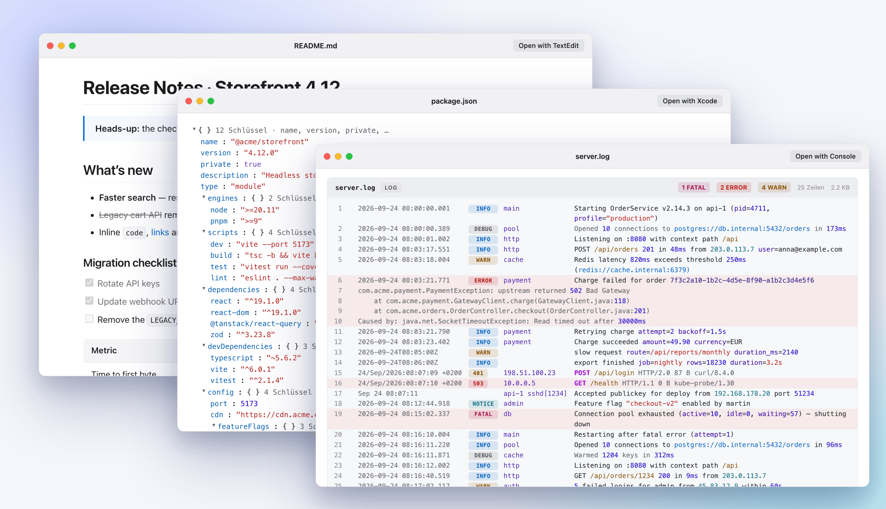
</picture>

<sub>Jede Vorschau auf dieser Seite ist Loupes echte HTML-Ausgabe, erzeugt von den tatsächlichen Renderern — gezeichnet ist nur der Fensterrahmen (<a href="#-screenshots--mockups">wie</a>). Die Bilder folgen deinem hellen oder dunklen GitHub-Theme.</sub>

<br><br>

<a href="https://www.paypal.com/donate/?business=martin.pfeffer%40celox.io&item_name=Loupe&currency_code=EUR">
  
</a>

</div>

---

## 📑 Inhalt

- [Warum Loupe?](#-warum-loupe)
- [Galerie](#-galerie) — [JSON](#-json) · [Markdown](#-markdown) · [Log-Dateien](#-log-dateien) · [Quellcode](#-quellcode) · [XML](#-xml) · [PowerShell & Batch](#-powershell--batch) · [TSV & CSV](#-tsv--csv)
- [Unterstützte Dateitypen](#-unterstützte-dateitypen)
- [Installation](#-installation)
- [Einstellungen](#%EF%B8%8F-einstellungen)
- [Leistung](#-leistung)
- [Sicherheit & Datenschutz](#-sicherheit--datenschutz)
- [Barrierefreiheit & Erscheinungsbild](#-barrierefreiheit--erscheinungsbild)
- [So funktioniert es](#%EF%B8%8F-so-funktioniert-es)
- [Tests](#-tests)
- [Fehlersuche](#-fehlersuche)
- [Mitwirken](#-mitwirken)
- [Lizenz](#-lizenz)

---

## ✨ Warum Loupe?

macOS zeigt die meisten Entwicklerdateien in Quick Look als graue Wand aus Monospace-Text — oder gar nicht. Loupe ersetzt das durch Vorschauen, die zum Lesen gemacht sind:

| | |
| :--- | :--- |
| 🌳 **JSON als Baum** — aufklappbar, in Dateireihenfolge, mit Zählern und Typfarben. Kaputte Dateien zeigen trotzdem alles bis zum Fehler, dazu einen Caret genau an der Stelle. | 🪵 **Logs zum Überfliegen** — Zeit, Level, Quelle und Nachricht in Spalten, Fehler getönt, Stacktraces zusammengehalten. Sieben Log-Formate werden erkannt. |
| 📝 **Markdown, gerendert** — CommonMark + GFM: Tabellen, Aufgabenlisten, hervorgehobener Code, lokale Bilder. | 🌈 **23 Sprachen hervorgehoben** — inklusive PowerShell und Batch, die macOS nicht einmal als Dateityp kennt. |
| ⚡ **Schnell** — eine 5-MB-JSON-Datei in 162 ms, ein 4-MB-Log in 338 ms. | 🔒 **Sicher gebaut** — Sandbox, nur lesend, strikte CSP, kein einziges Byte JavaScript, kein Netzwerk. |

---

## 🖼 Galerie

### 🌳 JSON

<picture>
  <source media="(prefers-color-scheme: dark)" srcset="docs/screenshots/json-dark.png">
  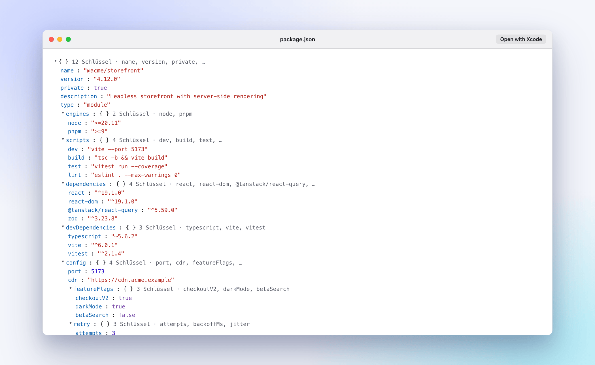
</picture>

- **Reihenfolgetreuer Parser** — Schlüssel bleiben in Dateireihenfolge, doppelte Schlüssel bleiben erhalten, Zahlen behalten ihre Schreibweise (`1.000` bleibt `1.000`, nicht `1`).
- **Kluges Aufklappen** — Knoten öffnen sich in der Breite zuerst, innerhalb eines Budgets von 300 sichtbaren Zeilen: eine `package.json` öffnet vollständig, ein Array mit 50.000 Elementen bleibt zu.
- **Zusammenfassungen** — jedes Objekt und Array zeigt seine Größe und eine Vorschau der ersten Schlüssel.
- **Reines HTML** — das Aufklappen nutzt `<details>`/`<summary>`, ohne Skript.

#### Wenn das JSON kaputt ist

<picture>
  <source media="(prefers-color-scheme: dark)" srcset="docs/screenshots/json-error-dark.png">
  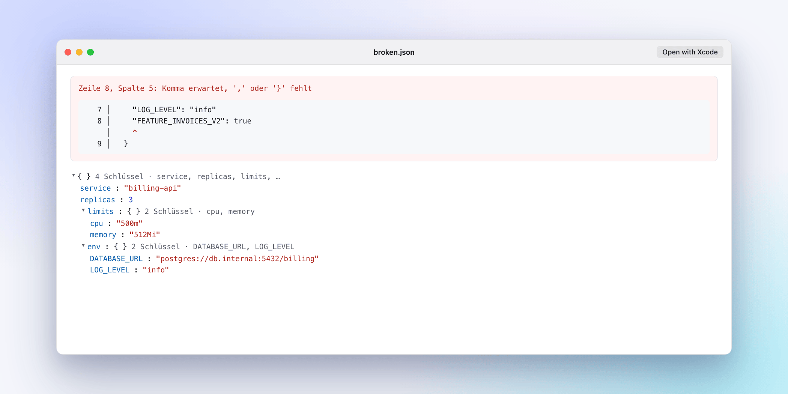
</picture>

Ein Syntaxfehler ergibt keine leere Seite: Loupe zeigt **Zeile, Spalte und einen Quelltext-Ausschnitt mit Caret**, darunter den Baum **bis zur Fehlerstelle**. Der Caret bleibt auch bei Tabs, Umlauten und Emoji ausgerichtet. Eine Datei, die Loupe nur wegen der Größengrenze *abgeschnitten* hat, wird als Hinweis gemeldet, nie als Fehler.

<details>
<summary><b>Alle JSON-Fähigkeiten</b></summary>

| Funktion | Detail |
| :--- | :--- |
| Objekte & Arrays | Zähler-Badges und eine Vorschau des zugeklappten Inhalts |
| Schlüsselreihenfolge | Exakt wie in der Datei, keine alphabetische Sortierung |
| Doppelte Schlüssel | Beide Vorkommen werden gezeigt |
| Zahlen | Wie geschrieben — keine Gleitkomma-Rundung, `1e400` wird nicht zu `inf` |
| Strings & Escapes | `\uXXXX`, Surrogatpaare (😀), Steuerzeichen |
| Teilbaum bei Fehlern | Alles vor dem Fehler Gelesene bleibt sichtbar |
| Fehlerausschnitt | Zeile, Spalte, Kontextzeilen, Caret — ausgerichtet für Tabs und Mehrbyte-Zeichen |
| JSON-Lines-Hinweis | Inhalt nach dem ersten Wert wird als JSON Lines erkannt und erklärt |
| Grenzen | Tiefe 64 · 20.000 Knoten · 1.000 Kinder je Container · 4 KB je String · 20 MB je Datei |

</details>

### 📝 Markdown

<picture>
  <source media="(prefers-color-scheme: dark)" srcset="docs/screenshots/markdown-dark.png">
  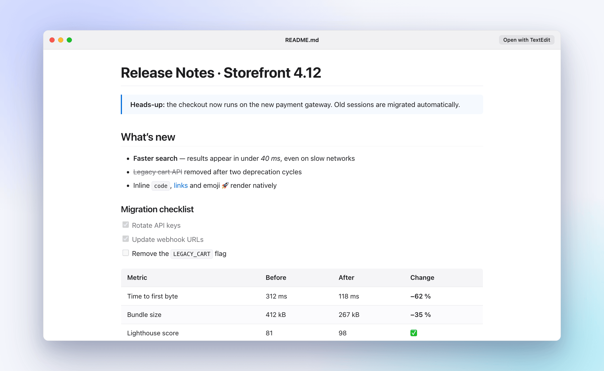
</picture>

CommonMark und GitHub Flavored Markdown über Apples [`swift-markdown`](https://github.com/apple/swift-markdown): Überschriften mit Ankern, Hervorhebungen, ~~Durchgestrichenes~~, Zitate, verschachtelte und nummerierte Listen, **Aufgabenlisten**, **Tabellen mit Ausrichtung**, Codeblöcke mit Syntaxhervorhebung und Sprach-Badge, Links und **lokale Bilder** (als Data-URI eingebettet, auf den Ordner des Dokuments beschränkt). Roh-HTML wird bereinigt, entfernte Bilder sind blockiert, solange du sie nicht erlaubst.

<details>
<summary><b>Alle Markdown-Fähigkeiten</b></summary>

| Funktion | Syntax | Detail |
| :--- | :--- | :--- |
| Überschriften | `#` … `######` | Automatisch erzeugte Anker |
| Hervorhebung | `**fett**`, `*kursiv*`, `~~durch~~` | SF-Pro-Typografie |
| Code | `` `inline` ``, Block ```` ```lang ```` | Hervorgehoben, mit Sprach-Badge |
| Zitate | `> Hinweis` | Hinweisblock mit Akzentlinie |
| Listen | `-`, `1.`, `3.` | Verschachtelt, eigene Startnummern |
| Aufgabenlisten | `- [x]`, `- [ ]` | Checkboxen im macOS-Stil |
| Tabellen | `\| a \| b \|` | Spaltenausrichtung, abwechselnde Zeilen |
| Links | `[t](https://…)` | Gefährliche Schemata (`javascript:`, `vbscript:`, `data:text/html`) werden entschärft |
| Bilder | `` | Nur lokale Dateien, Pfad-Traversal blockiert, entfernte Bilder standardmäßig aus |
| Roh-HTML | `<div>…</div>` | `<script>`, `<iframe>`, `<form>`, Event-Handler usw. werden entfernt |

</details>

### 🪵 Log-Dateien

<picture>
  <source media="(prefers-color-scheme: dark)" srcset="docs/screenshots/log-dark.png">
  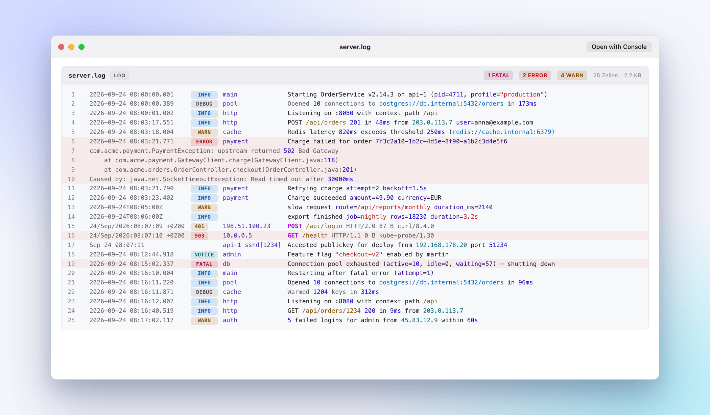
</picture>

Jede Zeile wird in **Zeit · Level · Quelle · Nachricht** zerlegt — egal in welchem Format, auch wenn eine Datei Formate mischt. Das Level wird vereinheitlicht (`WARN`, `warning`, `W` und pinos `40` werden alle zu **WARN**), die Werkzeugleiste zählt FATAL/ERROR/WARN, und Fehlerzeilen sind samt Stacktrace getönt. URLs, IPs, Zahlen mit Einheit, UUIDs, Pfade und `key=value`-Paare werden in Nachrichten hervorgehoben.

| Format | Beispiel | Erkannt wird |
| :--- | :--- | :--- |
| **Generisches Anwendungs-Log** | `2026-09-24 17:01:02.123 INFO [main] Started` | Zeit, Level, `[Quelle]`, Nachricht — auch `[Zeit]`, reine Uhrzeit, `[LEVEL]`, `level=…`, `kanal.LEVEL:` (Laravel/Monolog), `LEVEL:logger:msg` (Python) |
| **nginx-/Apache-Access-Log** | `203.0.113.7 - - [24/Sep/2026:…] "GET / HTTP/1.1" 503 0 …` | Client, Methode, Pfad, Protokoll, Status nach Klasse eingefärbt, Größe, Referer, User-Agent · 4xx → WARN, 5xx → ERROR |
| **JSON Lines** | `{"time":…,"level":"error","msg":"boom"}` | `time`/`ts`/`@timestamp`, `level`/`severity` (inkl. pino-Zahlen), `msg`/`message`, `logger`; alles andere als `key=value`. Unix-Zeiten werden zu lesbarem UTC |
| **logfmt** | `time=… level=warning msg="disk low"` | Dieselben Felder wie JSON Lines |
| **syslog / journalctl** | `Sep 24 17:01:02 host sshd[1234]: …` | Zeit, Host + Prozess[PID], Nachricht — auch mit ISO-Zeit (`journalctl -o short-iso`, macOS `install.log`) |
| **macOS Unified Log** | Ausgabe von `log show` | Zeit, Prozess[PID], Typ → Level (Default → NOTICE, Error → ERROR, Fault → FATAL) |
| **Android logcat** | `09-24 17:01:02.123 1234 5678 E Tag: …` | Zeit, Level-Buchstabe, Tag, Nachricht (threadtime und brief) |

- **Level zählen nur am Zeilenanfang** — eine Nachricht, die „error“ bloß erwähnt, ist kein Fehler. Ohne Zeitstempel muss ein nacktes Level-Wort GROSS geschrieben sein oder ein `:` folgen (`Info about the job` bleibt Fließtext).
- **Große Logs werden vom Ende gelesen.** Logs wachsen unten, also liest Loupe die letzten 4 MB und zeigt die neuesten 5.000 Zeilen — mit **absoluten Zeilennummern** (der übersprungene Teil wird bis 512 MB mitgezählt). Ein Hinweis nennt genau, was ausgelassen wurde.
- Zum Ausprobieren: [`Tests/Fixtures/logs/`](Tests/Fixtures/logs/) enthält je Format eine Beispieldatei plus Grenzfälle; `python3 Scripts/generate_large_log.py` erzeugt ein 12-MB-Log für den Tail-Pfad.

### 🌈 Quellcode

<picture>
  <source media="(prefers-color-scheme: dark)" srcset="docs/screenshots/code-dark.png">
  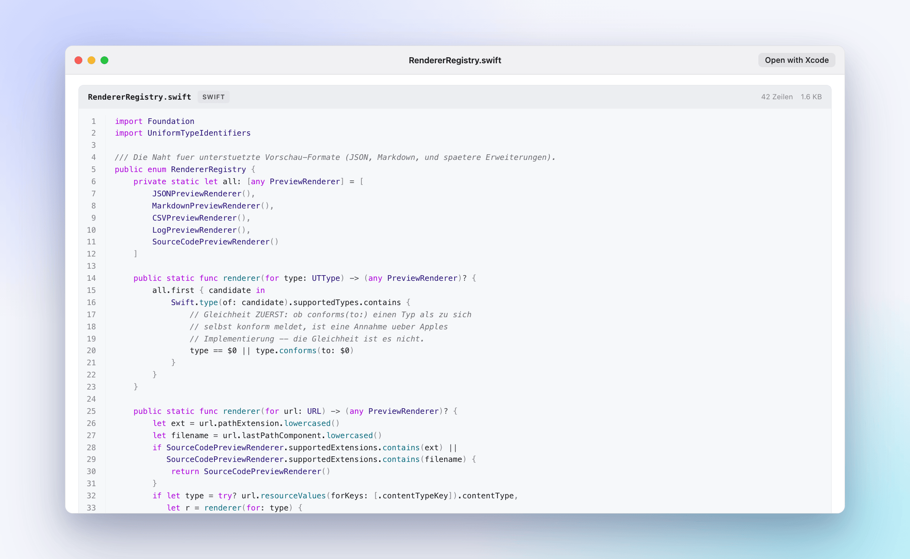
</picture>

Ein in Swift geschriebener Tokenizer hebt **23 Sprachen** hervor: Swift, Rust, Python, JavaScript, TypeScript, Go, Java, Kotlin, C, C++, PHP, Ruby, SQL, Shell/Bash/Zsh, **PowerShell**, **Batch**, JSON, YAML, TOML/INI, XML/HTML, CSS, Dockerfile — mit Zeilennummern, Sprach-Badge und Dateistatistik. Tokens werden auf der Host-Seite zu `<span>`s; in der Vorschau läuft nichts.

### 🧩 XML

<picture>
  <source media="(prefers-color-scheme: dark)" srcset="docs/screenshots/xml-dark.png">
  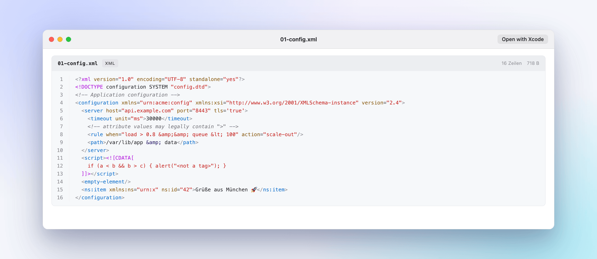
</picture>

Ein eigener XML-Tokenizer, der Anführungszeichen beachtet: Elementnamen, Attribute, Werte und Klammern bekommen je eine eigene Farbe, ebenso die `<?xml … ?>`-Deklaration, `<!DOCTYPE …>` (samt internem DTD-Teil), Kommentare, **CDATA-Abschnitte** (als Text, nicht als Markup) und Entities wie `&amp;` oder `&#x1F600;`. Ein `>` in einem Attributwert, Kommentar, CDATA-Block oder DOCTYPE beendet nie ein Tag. Derselbe Tokenizer hebt HTML-Codeblöcke in Markdown hervor; dort ist der Inhalt von `<script>`/`<style>` Rohtext.

Neben `.xml` deklariert Loupe einen Typ für **13 XML-Dialekte**, die macOS nicht kennt — `.xsd`, `.xsl`, `.xslt`, `.xaml`, `.csproj`, `.vbproj`, `.fsproj`, `.vcxproj`, `.props`, `.targets`, `.resx`, `.wsdl`, `.nuspec` —, damit Quick Look auch sie an Loupe gibt. `.svg`, `.rss` und `.plist` bleiben bei macOS (eine SVG wird weiter als Bild gezeigt), `.storyboard`/`.xib`/`.entitlements` bleiben Xcode überlassen.

### 🪟 PowerShell & Batch

<table>
<tr>
<td width="50%">
<picture>
  <source media="(prefers-color-scheme: dark)" srcset="docs/screenshots/powershell-dark.png">
  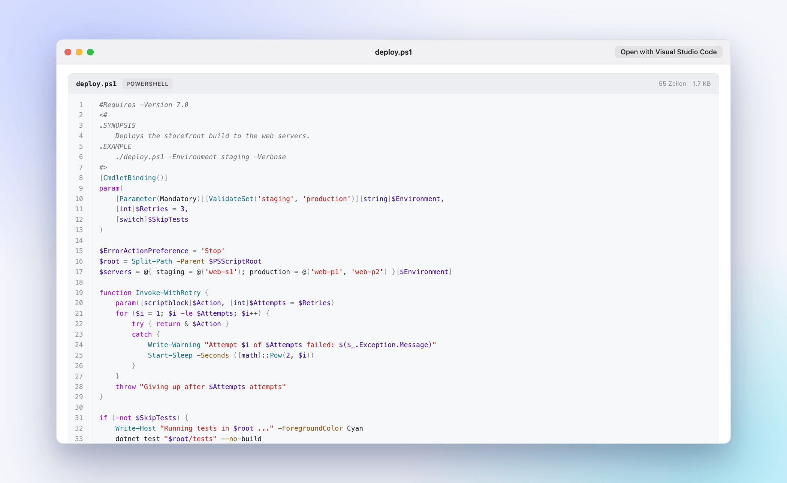
</picture>
</td>
<td width="50%">
<picture>
  <source media="(prefers-color-scheme: dark)" srcset="docs/screenshots/batch-dark.png">
  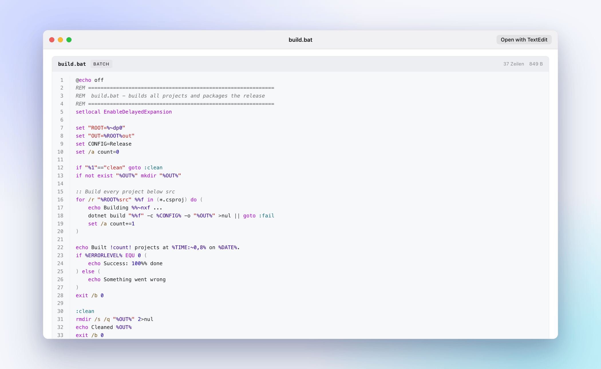
</picture>
</td>
</tr>
</table>

macOS vergibt für `.ps1`, `.bat` und `.cmd` nur einen *dynamischen* Typ — keine Quick-Look-Erweiterung wird dafür je gefragt. Loupe deklariert echte Typen (`com.microsoft.powershell-script`, `com.microsoft.batch-file`) und bringt eigene Tokenizer mit:

- **PowerShell** — `<# Hilfe #>`-Blöcke und `#`-Kommentare, Variablen inkl. Bereichen (`$env:PATH`, `$script:x`, `${beliebiger Name}`), Cmdlets (`Get-ChildItem`), Parameter (`-Path`), Wort-Operatoren (`-eq`, `-notin`, `-match`), Typ-Literale (`[string]`, `[System.IO.File]`), Strings mit **Einsetzung** von `$var` und `$(…)`, Here-Strings `@" … "@`, Größen-Literale (`10MB`), Schlüsselwörter ohne Groß-/Kleinschreibung.
- **Batch** — `REM`- und `::`-Kommentare, Sprungmarken und `goto :eof`, jede Variablenform (`%PATH%`, `%~dp0`, `%1`, `%%i`, `%%~nxf`, `!verzögert!`, `%DATE:~0,4%`), Schalter (`/b`, `/a`), Schlüsselwörter ohne Groß-/Kleinschreibung (`IF NOT EXIST`, `EQU`, `ERRORLEVEL`).

### 📊 TSV & CSV

<picture>
  <source media="(prefers-color-scheme: dark)" srcset="docs/screenshots/tsv-dark.png">
  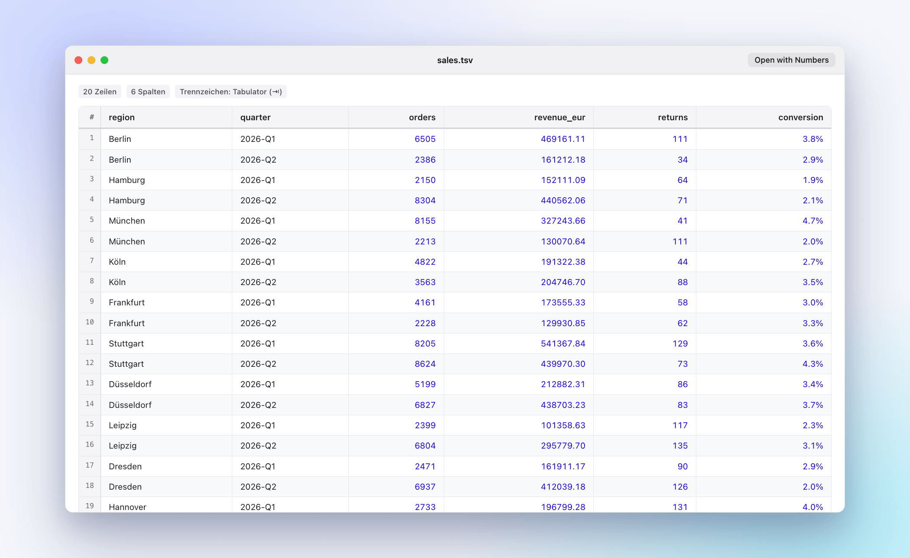
</picture>

Tabulatorgetrennte und andere Trennzeichen-Dateien werden zur echten Tabelle: **fixierte Kopfzeile**, **fixierte Zeilennummern**, Zahlen rechtsbündig mit Tabellenziffern, automatische Trennzeichenerkennung (`,` `;` `\t`), RFC-4180-Anführungszeichen inklusive mehrzeiliger Zellen, dazu eine Übersichtsleiste. Grenzen: 2.000 Zeilen × 200 Spalten.

> [!IMPORTANT]
> **Kommagetrennte `.csv`-Dateien zeigt Loupe nicht an — und keine Quick-Look-Erweiterung kann das ändern.** macOS leitet `public.comma-separated-values-text` an seinen eingebauten `/System/Library/QuickLook/Office.qlgenerator`, der Vorrang vor allen Erweiterungen von Drittanbietern hat und den Dunkelmodus ignoriert. Loupe registriert den Typ, trotzdem ruft Quick Look es für `.csv` nie auf (im Unified Log belegt; eine `.tsv` in derselben Sitzung erreicht Loupe). Ein eigener Typ für `.csv` hilft auch nicht — Launch Services behält Apples Zuordnung. Der Generator liegt auf dem SIP-geschützten Systemvolume. An derselben Wand scheitern CSV-Plugins seit macOS 10.15 ([p2/quicklook-csv#26](https://github.com/p2/quicklook-csv/issues/26)). **Umweg:** Tabellendaten als `.tsv` speichern.

---

## 📂 Unterstützte Dateitypen

Entscheidend ist nicht, was Loupe rendern *kann*, sondern was **Quick Look tatsächlich an Loupe übergibt**. Diese Tabelle wird per Unit-Test (`DocsSyncTests`) gegen die Registrierung der Erweiterung geprüft.

<!-- filetypes:start -->
| Format | Endungen | Typ (UTI) | Finder-Vorschau |
| :--- | :--- | :--- | :---: |
| JSON | `.json` | `public.json` | ✅ |
| Markdown | `.md` `.markdown` | `net.daringfireball.markdown` | ✅ |
| Log | `.log` | `com.apple.log` → `public.log` | ✅ |
| Tabulatorgetrennt | `.tsv` | `public.tab-separated-values-text` | ✅ |
| Kommagetrennt | `.csv` | `public.comma-separated-values-text` | ❌ von macOS reserviert, [siehe oben](#-tsv--csv) |
| PowerShell | `.ps1` `.psm1` `.psd1` | `com.microsoft.powershell-script` *(von Loupe deklariert)* | ✅ |
| Batch | `.bat` `.cmd` | `com.microsoft.batch-file` *(von Loupe deklariert)* | ✅ |
| Swift · Rust · Go | `.swift` `.rs` `.go` | `public.swift-source` · `org.rust-lang.rust-script` · `org.golang.go-script` | ✅ |
| Python · Ruby · PHP | `.py` `.rb` `.php` | `public.python-script` · `public.ruby-script` · `public.php-script` | ✅ |
| JavaScript | `.js` `.mjs` | `com.netscape.javascript-source` | ✅ |
| Java · Kotlin | `.java` `.kt` `.kts` | `com.sun.java-source` · `org.kotlinlang.source` | ✅ |
| C · C++ | `.c` `.h` `.cpp` `.cc` `.cxx` `.hpp` `.hxx` `.h++` | `public.c-source` · `public.c-plus-plus-source` · Header | ✅ |
| Shell | `.sh` `.bash` `.zsh` | `public.shell-script` und Varianten | ✅ |
| SQL | `.sql` | `org.iso.sql` | ✅ |
| YAML · TOML · INI | `.yaml` `.yml` `.toml` `.ini` | `public.yaml` · `public.toml` · `com.microsoft.ini` | ✅ |
| XML | `.xml` | `public.xml` | ✅ |
| XML-Dialekte | `.xsd` `.xsl` `.xslt` `.xaml` `.csproj` `.vbproj` `.fsproj` `.vcxproj` `.props` `.targets` `.resx` `.wsdl` `.nuspec` | `io.celox.loupe.xml-document` *(von Loupe deklariert)* | ✅ |
| CSS | `.css` | `public.css` | ✅ |
<!-- filetypes:end -->

**Hervorgehoben, aber aus dem Finder nicht erreichbar** — macOS vergibt dafür entweder einen *dynamischen* Typ oder einen, der etwas anderem gehört, deshalb fragt Quick Look Loupe nie:

<!-- unreachable:start -->
- `.ts` — macOS führt das als **MPEG-2-Transportstrom** (Video). Den Typ zu beanspruchen würde echte Videodateien als Text anzeigen.
- `.tsx` `.jsx` `.cjs` `.pyw` `.scss` `.sass` `.less` `.dockerfile` — nur dynamische Typen.
<!-- unreachable:end -->

Dasselbe gilt für `.out`, `.err` und rotierte Logs wie `app.log.1`: dynamische Typen — und `.out` zu beanspruchen würde zudem Binärdateien wie `a.out` zu Text machen.

---

## 📦 Installation

### Download (empfohlen)

1. `Loupe-vX.Y.Z-macOS.zip` vom [aktuellen Release](https://github.com/pepperonas/loupe/releases/latest) laden — die Builds sind für **Apple Silicon (arm64)**. Jedes Release enthält eine `SHA256SUMS.txt`.
2. Entpacken und `Loupe.app` nach `/Applications` verschieben.
3. Die App ist **ad hoc signiert**, nicht notarisiert. Beim ersten Start verweigert macOS das Öffnen — entweder Rechtsklick → **Öffnen**, über **Systemeinstellungen → Datenschutz & Sicherheit → Trotzdem öffnen**, oder per Terminal:
   ```bash
   xattr -dr com.apple.quarantine /Applications/Loupe.app
   ```
4. Loupe einmal starten. Das Fenster zeigt, ob die Quick-Look-Erweiterung registriert ist.

### Aus dem Quellcode bauen

Benötigt die Kommandozeilen-Werkzeuge von Xcode 16 / Swift 6. Ein Xcode-Projekt ist nicht nötig.

```bash
git clone https://github.com/pepperonas/loupe.git
cd loupe
./Scripts/install_app.sh      # bauen (release), ad hoc signieren, nach /Applications installieren, registrieren, Quick Look zurücksetzen
```

`Scripts/build_app.sh [debug|release]` baut nur das Bundle nach `build/Loupe.app`; `Scripts/package_release.sh vX.Y.Z` erzeugt das Release-ZIP samt Prüfsummen.

### Erweiterung aktivieren

Quick-Look-Erweiterungen von Drittanbietern müssen einmal freigegeben werden:

- **Ab macOS 15:** Systemeinstellungen → **Allgemein → Anmeldeobjekte & Erweiterungen** → *Quick Look* → **Loupe** einschalten.
- **macOS 14:** Systemeinstellungen → **Datenschutz & Sicherheit → Erweiterungen → Quick Look** → **Loupe** einschalten.
- Oder im Terminal: `pluginkit -e use -i io.celox.loupe.preview`

Danach im Finder eine Datei auswählen und die <kbd>Leertaste</kbd> drücken.

---

## ⚙️ Einstellungen

Die Begleit-App (`Loupe.app`) zeigt den aktuellen Registrierungsstatus der Erweiterung, Hinweise zur Einrichtung und drei Einstellungen, die über eine App Group mit der Erweiterung geteilt werden:

| Einstellung | Optionen | Gilt für |
| :--- | :--- | :--- |
| **Erscheinungsbild** | System · Hell · Dunkel | Alle Vorschauen |
| **Textgröße** | Klein · Standard · Groß | Alle Vorschauen |
| **Markdown-Breite** | Kompakt 680 px · Standard 840 px · Breit 1040 px · Volle Breite | Markdown |

> [!NOTE]
> Die Oberfläche der App und der Vorschau-Rahmen (z. B. „12 Schlüssel“, „25 Zeilen“) sind derzeit **deutsch**. Dateiinhalte erscheinen natürlich so, wie sie sind.

---

## ⚡ Leistung

Gemessen von der Test-Suite (Release-Build, Apple M1 Pro, macOS 27). Die Suite erzwingt harte Obergrenzen für die großen Fälle — 1 s im Release-Build, 2,5 s im Debug-Build auf geteilten CI-Runnern —, eine Leistungsregression lässt den Build also scheitern.

| Eingabe | Renderer | Zeit |
| :--- | :--- | ---: |
| Kleines JSON-Dokument | JSON-Baum | **8 ms** |
| 5 MB JSON | JSON-Baum (Knotengrenze greift) | **162 ms** |
| 4 MB Log (≈ 40.000 Zeilen → neueste 5.000) | Log-Tabelle | **338 ms** |

Große Dateien werden nie vollständig gelesen: JSON und Code höchstens 20 MB vom Anfang, Logs vom Ende (4 MB).

---

## 🔒 Sicherheit & Datenschutz

Entwicklerdateien stammen oft aus fremden Quellen (`git clone`, Downloads, Build-Artefakte). Loupe behandelt jede Datei als feindliche Eingabe:

- **Sandbox & nur lesend** — die Erweiterung läuft in der App Sandbox mit `com.apple.security.files.user-selected.read-only`, sonst nichts.
- **Kein JavaScript, nirgends** — Vorschauen sind statisches HTML + CSS. Das Aufklappen nutzt `<details>`.
- **Strikte Content Security Policy** — `default-src 'none'; style-src 'unsafe-inline'; img-src 'none'` (Markdown: `img-src data: cid:`). Keine Richtlinie erlaubt `script-src`.
- **Alles wird maskiert** — jeder Wert, Schlüssel, jedes Log-Feld, jeder Dateiname und jedes Code-Token läuft durch HTML-Escaping; Tests schicken `<script>` und `onerror=` durch jeden Renderer.
- **Markdown-Bereinigung** — gefährliche Elemente und Event-Handler werden entfernt, `javascript:`/`vbscript:`/`data:text/html`-Links entschärft.
- **Schutz vor Pfad-Traversal** — lokale Bilder werden mit aufgelösten Symlinks geprüft und müssen im Ordner des Dokuments liegen.
- **Kein Netzwerk** — entfernte Bilder sind standardmäßig blockiert (keine Tracking-Pixel), es gibt keine Telemetrie und keine Update-Prüfung.
- **Harte Grenzen gegen feindliche Dateien** — JSON-Tiefe 64 (Schutz vor Stapelüberlauf), 20.000 Knoten, 1.000 Kinder je Container, 4 KB je angezeigtem String, 20 MB je Datei; Logs 4 MB / 5.000 Zeilen; Tabellen 2.000 Zeilen × 200 Spalten.

---

## 🎨 Barrierefreiheit & Erscheinungsbild

Helles und dunkles Erscheinungsbild folgen dem System (oder deiner Wahl in der App) und nutzen SF Pro / SF Mono. Jede Farbrolle erfüllt **WCAG AA (≥ 4,5 : 1)**:

- **JSON-, Markdown- und Code-Farben** wurden auf einem Canvas über ihren echten Hintergründen gemessen (`Scripts/measure_contrast.html`) — Verhältnisse von **6,4 : 1** bis **16,8 : 1**.
- **Log-Farben** (alle Level, HTTP-Statusklassen, Zeitstempel, Quellen) prüft ein **Unit-Test** in beiden Erscheinungsbildern — auch auf dem getönten Hintergrund von Fehlerzeilen.

<details>
<summary><b>Gemessene JSON-/Markdown-Farbrollen</b></summary>

| Rolle | Hell (`#ffffff`) | Dunkel (`#1e1e1e`) |
| :--- | :--- | :--- |
| Text | `#1d1d1f` · 16,83 : 1 | `#f5f5f7` · 15,31 : 1 |
| Gedimmter Text | `#5b5e69` · 6,46 : 1 | `#a1a1a6` · 6,48 : 1 |
| Objektschlüssel | `#0b5fb0` · 6,41 : 1 | `#7ab8ff` · 8,04 : 1 |
| String | `#b3261e` · 6,54 : 1 | `#ff8170` · 6,85 : 1 |
| Zahl | `#1c00cf` · 10,77 : 1 | `#dabaff` · 9,88 : 1 |
| Boolean | `#7a3ea3` · 6,90 : 1 | `#d8a0ff` · 8,25 : 1 |
| Schlüsselwort | `#af00db` · 6,42 : 1 | `#ff7ab2` · 8,12 : 1 |
| Link | `#0066cc` · 6,82 : 1 | `#2997ff` · 7,84 : 1 |
| Fehlerbanner | `#a5251c` · 6,72 : 1 | `#ff8a80` · 6,64 : 1 |

Gegenprobe: `#cccccc` auf `#ffffff` misst 1,61 : 1 — die Messung erkennt Verstöße also zuverlässig.

</details>

---

## 🏗️ So funktioniert es

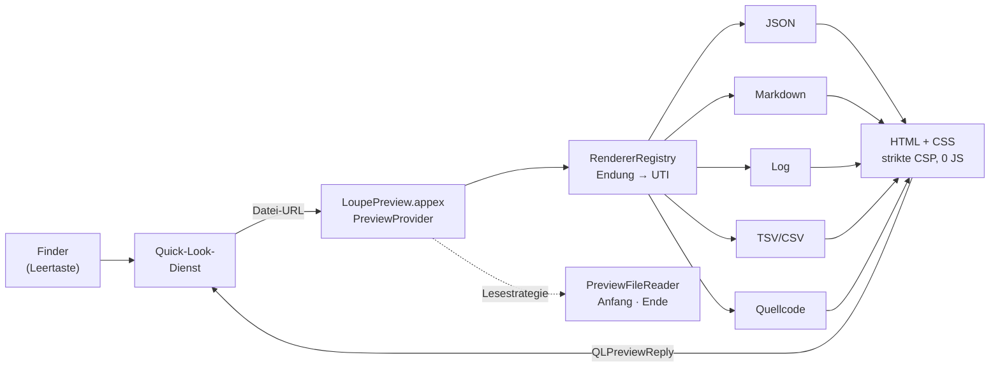

1. Der **Finder** fragt Quick Look nach einer Vorschau; Quick Look übergibt die Datei-URL an die **Erweiterung**, weil ihr Typ in `QLSupportedContentTypes` steht.
2. Die **`RendererRegistry`** wählt den Renderer zuerst nach Dateiendung, dann nach Typ (UTI).
3. Der Renderer legt fest, **wie gelesen wird**: vom Anfang (Dokumente, Code) oder vom **Ende** (Logs); `PreviewFileReader` liest nur diesen Teil.
4. Der Renderer liefert eine **eigenständige HTML-Seite** (Stile eingebettet, strikte CSP); Quick Look zeigt sie in WebKit an.

<details>
<summary><b>Projektaufbau</b></summary>

```text
Loupe.app                         Begleit-App (AppKit): Status, Einstellungen
└── Contents/PlugIns/LoupePreview.appex   Quick-Look-Erweiterung (QLPreviewProvider)

Sources/
├── Loupe/                        Begleit-App
├── LoupePreview/                 Einstiegspunkt der Erweiterung + Info.plist (QLSupportedContentTypes)
└── LoupeCore/                    Alles Testbare
    ├── JSON/                     Lexer, reihenfolgetreuer Parser mit Wiederaufsetzen, Quelltext-Ausschnitte
    ├── Markdown/                 swift-markdown-Visitor, Bereinigung, sicheres Laden von Bildern
    ├── CSV/                      RFC-4180-Parser mit Trennzeichenerkennung, Tabellen-Renderer
    ├── Log/                      Log-Modell, Formaterkennung, Hervorhebung in Nachrichten
    ├── Highlighting/             Tokenizer für 23 Sprachen (inkl. PowerShell & Batch)
    ├── Preview/                  Renderer-Protokoll, Registry, Dateileser, ein Renderer je Format
    ├── Render/                   JSON-Baum, Aufklapp-Planung, HTML-Escaping
    ├── Theme/                    CSS-Generator (hell/dunkel, WCAG AA)
    ├── Configuration/            Einstellungen, geteilt über die App Group
    └── Utilities/                Statusprüfung der Erweiterung (pluginkit)

Tests/LoupeTests/                 Test-Suite (swift run LoupeTests)
Tests/Fixtures/                   Beispieldateien: JSON, Markdown, logs/, scripts/
Tools/ScreenshotGenerator/        Erzeugt die Mockups dieser Seite
Scripts/                          Bauen, Installieren, Paketieren, Badges, Generator für große Logs
```

</details>

---

## 🧪 Tests

```bash
swift run LoupeTests              # Debug
swift run -c release LoupeTests   # Release (wie im Release-Workflow)
```

**306 Tests** in einem abhängigkeitsfreien Test-Harness, bei jedem Push von der CI ausgeführt:

| Bereich | Tests | Schwerpunkte |
| :--- | ---: | :--- |
| JSON | 70 | Reihenfolge, Duplikate, Zahlenschreibweise, Wiederaufsetzen, Grenzen inkl. Tiefenbombe, Caret-Ausrichtung |
| Log-Dateien | 64 | Alle sieben Formate, Level-Vereinheitlichung, Stacktraces, CRLF, Lesen vom Ende, absolute Zeilennummern, WCAG-Kontrast |
| Hervorhebung | 63 | 23 Sprachen, XML/HTML mit Beachtung der Anführungszeichen, PowerShell & Batch, keine Phantom-Endzeile, **jedes druckbare Zeichen muss in jeder Sprache abbrechen und verlustfrei erhalten bleiben** |
| Markdown & Sicherheit | 41 | GFM, Umgehungsversuche der Bereinigung, Pfad-Traversal, Blockieren entfernter Bilder |
| TSV / CSV | 22 | RFC-4180-Anführungszeichen, Trennzeichenerkennung, Grenzen |
| Erscheinungsbild & Einstellungen | 19 | Helles/dunkles CSS, Migration der Einstellungen |
| Registry & App | 18 | Typ-Zuordnung, CSP, ungültiges UTF-8, leere Dateien, pluginkit-Auswertung |
| Doku-Abgleich | 6 | Diese README gegen den Code: Versionen, Test-Badge, Bildpfade, Gleichstand EN/DE, Erreichbarkeit im Finder |
| Leistung | 3 | Harte Zeitgrenzen für große Eingaben |

So bleiben die Tests ehrlich:

- **Mutationsgeprüft.** Neue Tests werden verifiziert, indem der bewachte Code absichtlich kaputtgemacht wird — ein Test, der gegen kaputten Code grün bleibt, wird neu geschrieben. So wurden mehrere zunächst blinde Tests gefunden und nachgeschärft.
- **Die Doku wird getestet.** `DocsSyncTests` schlägt fehl, wenn diese README einen Dateityp verspricht, den Quick Look nie liefert, wenn das Test-Badge veraltet ist oder die englische und deutsche README auseinanderlaufen. `Scripts/update_readme_stats.sh` aktualisiert die Badges.
- **Beispieldateien zum manuellen Testen** liegen in [`Tests/Fixtures/logs/`](Tests/Fixtures/logs/) und [`Tests/Fixtures/scripts/`](Tests/Fixtures/scripts/).

---

## 🛠️ Fehlersuche

| Symptom | Lösung |
| :--- | :--- |
| Finder zeigt weiter nur Text | Erweiterung aktivieren ([siehe oben](#erweiterung-aktivieren)), dann `qlmanage -r && qlmanage -r cache && killall Finder` |
| Ist die Erweiterung registriert? | `pluginkit -m -v -i io.celox.loupe.preview` — ein führendes `+` bedeutet aktiviert |
| Eine alte Version antwortet weiter | Alle Kopien auflisten: `pluginkit -m -A -v -p com.apple.quicklook.preview \| grep -i loupe`, veraltete entfernen, mit `./Scripts/install_app.sh` neu installieren |
| Welchen Typ vergibt macOS für eine Datei? | `mdls -name kMDItemContentType <datei>` — `dyn.…` heißt: keine Erweiterung wird gefragt |
| `.csv` bleibt weiß | Erwartet — macOS reserviert CSV, [siehe oben](#-tsv--csv). `.tsv` verwenden. |
| Erweiterung live beobachten | `log stream --predicate 'subsystem == "io.celox.loupe.preview"' --info` — protokolliert für jede Vorschau den gewählten Renderer und die Ausgabegröße |

---

## 🤝 Mitwirken

Issues und Pull Requests sind willkommen.

1. `swift run LoupeTests` muss grün bleiben — neues Verhalten kommt mit Tests (idealerweise zuerst einem roten).
2. Sichtbare Änderungen gehören in den [`CHANGELOG.md`](CHANGELOG.md) (Keep a Changelog, SemVer).
3. Darstellung geändert? Mockups neu erzeugen: `Tools/ScreenshotGenerator/generate.sh` (braucht Google Chrome; `pngquant` optional).
4. Testzahl oder Codeumfang geändert? `Scripts/update_readme_stats.sh`.
5. [`README.md`](README.md) und [`README.de.md`](README.de.md) gleichauf halten — der Doku-Abgleichstest prüft das.

## 📸 Screenshots & Mockups

Die Bilder dieser Seite erzeugt [`Tools/ScreenshotGenerator`](Tools/ScreenshotGenerator/): Ein kleines Swift-Werkzeug rendert die Beispieldateien über Loupes **echte `RendererRegistry` und Renderer** (hell und dunkel), ein Python-Skript setzt jedes Ergebnis in ein Quick-Look-Fenster im macOS-Stil, und Headless-Chrome nimmt es in 1,5-facher Auflösung auf. Rahmen und Hintergrund sind gezeichnet, der Inhalt ist Loupes unveränderte Ausgabe.

---

## 💖 Unterstützen

Wenn dir Loupe Zeit spart, freue ich mich über Unterstützung:

<a href="https://www.paypal.com/donate/?business=martin.pfeffer%40celox.io&item_name=Loupe&currency_code=EUR"></a>

## 📄 Lizenz

MIT — siehe [LICENSE](LICENSE). Mit ❤️ entwickelt von **Martin Pfeffer** · [celox.io](https://celox.io) · © 2026
