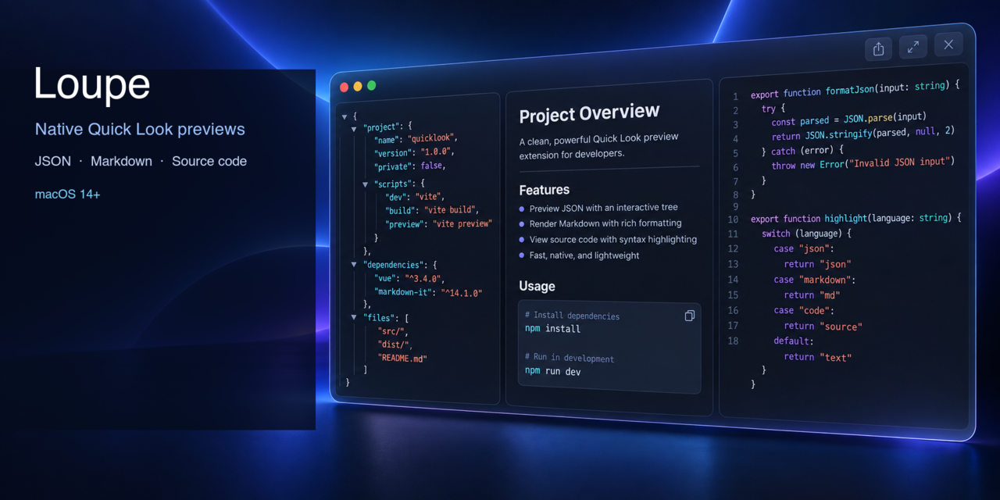
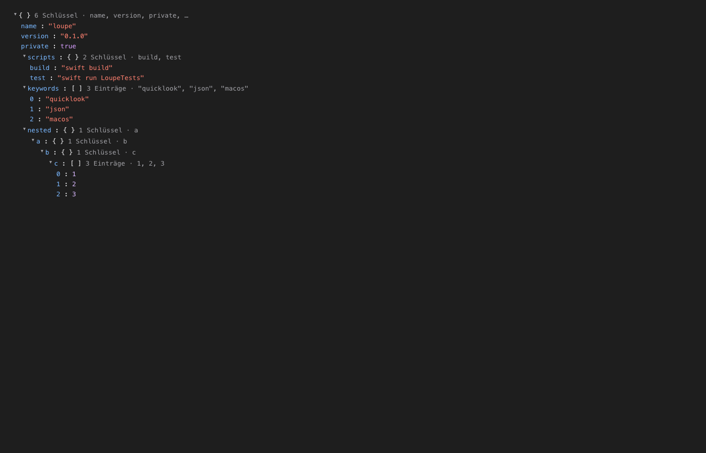
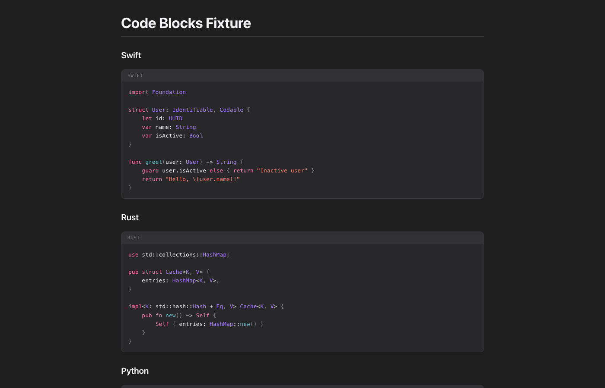
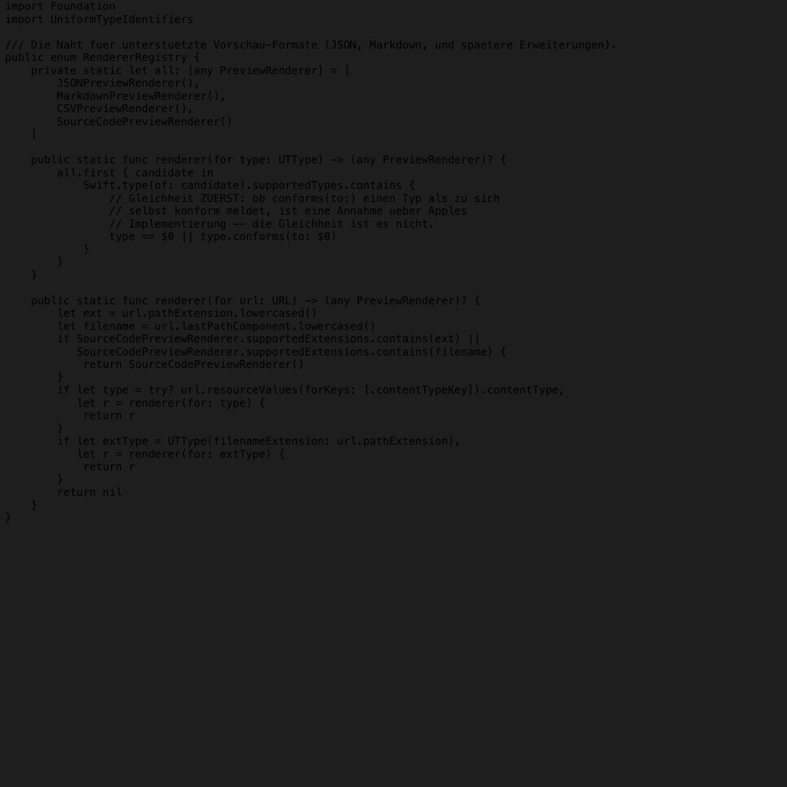

# Loupe

<div align="center">

  <a href="README.md">
    
  </a>
  &nbsp;
  <a href="README.de.md">
    
  </a>

  <br><br>

[](https://github.com/pepperonas/loupe/releases)
[](https://github.com/pepperonas/loupe/actions/workflows/ci.yml)
[](Tests/LoupeTests/)
[](Sources/)
[](LICENSE)
<br>
[](https://apple.com/macos)
[](https://swift.org)
[](Sources/LoupePreview/Resources/LoupePreview.entitlements)
[](https://github.com/pepperonas/loupe)
[](https://github.com/pepperonas/loupe)
[](https://github.com/pepperonas/loupe)
[](https://github.com/pepperonas/loupe/stargazers)
[](https://github.com/pepperonas/loupe/network/members)
[](https://github.com/pepperonas/loupe/issues)
[](https://github.com/pepperonas/loupe/releases)
[](https://semver.org)
[](CHANGELOG.md)
<br><br>

<br><br>
<a href="https://www.paypal.com/donate/?business=martin.pfeffer%40celox.io&item_name=Loupe&currency_code=EUR">
  
</a>

<br><br>

```
┌────────────────────────────────────────────────────────────────────────────┐
│  Finder → Select Any JSON (.json), Markdown (.md), or CSV/TSV File         │
│  Press Space → Instant native preview with zero JavaScript!                │
└────────────────────────────────────────────────────────────────────────────┘
```

</div>

---

## Overview

**Loupe** is a lightweight, blazing-fast native macOS application and Quick Look Preview Extension (`io.celox.loupe.preview`) that brings interactive, formatted developer file previews directly to the macOS Finder.

Loupe provides first-class, hardened support for developer files including:
- **JSON** (`public.json`): Collapsible tree with source-order preservation, type badges, member counts, syntax color roles, and smart breadth-first expansion.
- **Markdown** (`net.daringfireball.markdown`): Full CommonMark and GitHub Flavored Markdown (GFM) rendering with pure-Swift syntax highlighting for 17+ languages, formatted tables, task lists, and safe relative images.
- **CSV & TSV** (`public.comma-separated-values-text`, `public.tab-separated-values-text`, `public.delimited-values-text`): Clean, theme-aware tabular preview that fixes the macOS default preview's blinding white background in Dark Mode. Features automatic delimiter detection (`,`, `;`, `\t`), sticky headers, sticky row numbers, and numeric right-alignment.
- **Source code**: Native syntax-highlighted previews for Swift, Rust, Python, JavaScript/TypeScript, Go, Java/Kotlin, C/C++, HTML/XML, CSS, YAML, TOML, SQL, Shell, PHP, Ruby, and more.

Pressing **Space** on any supported file instantly renders a gorgeous preview — **without a single byte of JavaScript**, without Electron, and without background daemons.

Designed strictly according to Apple's Human Interface Guidelines, Loupe looks, behaves, and feels like a native macOS system component.

## Screenshots

These previews are rendered directly by Loupe's Finder Quick Look extension in Dark Mode — no JavaScript or external service is involved.

<p align="center">
  
  
  
</p>

<p align="center"><sub>JSON tree · Markdown document · Swift source code</sub></p>

---

## Key Features

- ⚡ **Instant Preview**: Rapid startup using Apple's modern data-based `QLPreviewProvider` and `QLPreviewReply` APIs (macOS 14.0+). Renders 50 KB JSON in under 10 ms and 5 MB files in ~160 ms.
- 🌳 **Zero-JavaScript Collapsible Tree**: Interactive JSON tree powered purely by HTML5 `<details>` and `<summary>` elements. Absolutely no script execution, no client-side evaluation, no event listener overhead.
- 📝 **Rich CommonMark & GFM Markdown**: Headings (H1–H6 with auto-slug anchors), bold, italic, strikethrough, blockquotes, ordered/unordered lists, task lists with checkboxes, and styled tables.
- 🌈 **Pure-Swift Syntax Highlighting**: In-process tokenization for 17+ programming languages (Swift, Rust, Python, JavaScript, TypeScript, Go, Java, Kotlin, C/C++, HTML, CSS, JSON, YAML, XML, SQL, Shell/Bash, Markdown) without client-side JavaScript execution.
- 💻 **First-Class Source-Code Previews**: Finder previews for common source formats with readable monospace layout, language-aware token colors, and safe handling of unknown extensions.
- 📐 **Order-Preserving & Exact AST**: Preserves exact source key order, retains duplicate keys, and keeps original number spellings (e.g. `1.000` vs `1e3`).
- 🧭 **Smart Breadth-First Expansion (BFS)**: Instead of arbitrary fixed-depth unfolding, Loupe uses a line-budget algorithm (default: 300 visible rows). A standard `package.json` opens completely, while massive arrays stay safely collapsed at root.
- 🩹 **Resilient Error Recovery & Source Excerpts**: If a JSON file contains syntax errors, Loupe renders the valid partial tree parsed up to the error, accompanied by an error banner showing line, column, context window, and an exact caret pointer (`^`) with UTF-8 character and tab alignment.
- 🛡️ **Hardened Limits & DoS Protection**: Stack-overflow protection through a depth guard (max 64 levels), memory safety via node limits (20,000 nodes), container child limits (1,000 children), string display caps (4 KB), and file size boundaries (20 MB for JSON, 5 MB for Markdown).
- 🔒 **Zero Telemetry & Path Traversal Guards**: Isolated within macOS's App Extension Sandbox (`com.apple.security.app-sandbox`) with read-only access. Local relative images are safely embedded via Base64 with symlink canonicalization. Remote images are blocked by default to prevent tracking pixels.
- 🎨 **Apple Typography & Contrast-Verified Themes**: Dual Light and Dark themes styled with `SF Pro`, `SF Mono`, and `ui-monospace`. All semantic color roles are verified on an HTML5 canvas against WCAG AA standards (all ratios > 4.5:1, ranging from 6.4:1 to 16.8:1).
- 📊 **Native, Theme-Aware CSV & TSV**: Fixes macOS Quick Look's glaring white CSV preview by honoring macOS Dark Mode. Features RFC 4180 parsing, automatic delimiter detection (`,`, `;`, `\t`), sticky header row, sticky row numbering (`#`), and numeric right-alignment.
- 💻 **Native Companion App**: Built-in AppKit companion app providing live Quick Look extension registration status, troubleshooting tips, and user preferences for appearance, text size, and Markdown content width.

---

## Supported JSON Features & Capabilities

| Feature | Description | Supported | Technical Detail |
| :--- | :--- | :---: | :--- |
| **Objects (`{ ... }`)** | Nested dictionary structures | ✅ | Shows member count badge and collapsed key preview peek |
| **Arrays (`[ ... ]`)** | Sequential value lists | ✅ | Shows item count badge and element type/index preview |
| **Source Key Order** | Exact document sequence | ✅ | Preserves file order without alphabetical re-sorting |
| **Duplicate Keys** | Repeated object keys | ✅ | Preserves and displays both occurrences |
| **Numeric Precision** | Arbitrary precision numbers | ✅ | Keeps exact source representation without float rounding |
| **Strings & Escapes** | UTF-8 strings & surrogates | ✅ | Handles `\uXXXX` escapes, surrogate pairs (e.g. `😀`), and newlines |
| **Collapsible Nodes** | Native folder interaction | ✅ | HTML5 `<details>`/`<summary>` with animated indicator |
| **Smart Expansion** | Initial open/closed state | ✅ | Breadth-first queue within configurable line budget |
| **Partial Tree Recovery** | Resilient error recovery | ✅ | Shows valid nodes parsed prior to syntax failure |
| **Error Excerpt** | Visual syntax error locator | ✅ | Displays line, column, source excerpt, and caret (`^`) |
| **Unicode & Emojis** | Multilingual & multi-byte UTF-8 | ✅ | Column caret alignment accurately maps multi-byte characters |
| **Tab Alignment** | Tab expansion in excerpts | ✅ | Expands `\t` to spaces so carets stay visually aligned |
| **Truncation Banner** | Safe file limit notification | ✅ | Distinguishes between intentional limits and file errors |
| **Dark & Light Modes** | System appearance support | ✅ | Media query isolation; manual override in settings |
| **Configurable Sizes** | Small, Medium, Large typography | ✅ | Configured via Shared App Group UserDefaults |

---

## Supported Markdown Features

| Feature | Syntax Example | Supported | Details |
| :--- | :--- | :---: | :--- |
| **Headings** | `# H1` through `###### H6` | ✅ | Includes auto-generated anchor IDs for internal navigation |
| **Emphasis** | `**bold**`, `*italic*`, `***both***` | ✅ | Apple SF Pro typography |
| **Strikethrough** | `~~deleted text~~` | ✅ | GitHub Flavored Markdown (GFM) `<del>` |
| **Inline Code** | `` `let value = 10` `` | ✅ | Monospace font with subtle container and border |
| **Code Blocks** | ```` ```swift ... ``` ```` | ✅ | Syntax highlighted with language header and badge |
| **Blockquotes** | `> Callout quote` | ✅ | Native Apple callout styling with accent border |
| **Lists** | `- Unordered`, `1. Ordered` | ✅ | Tight spacing, nested lists, custom start indices |
| **Task Lists** | `- [x] Done`, `- [ ] Pending` | ✅ | Custom native checkboxes styled to match macOS |
| **Tables** | `\| Header \| Cell \|` | ✅ | Alternating row backgrounds and border styling |
| **Thematic Breaks** | `---` | ✅ | Subtle macOS dividers |
| **Safe Links** | `[Title](https://...)` | ✅ | Opens in default browser (`target="_blank"`) |
| **Images** | `` | ✅ | Safe local relative loading via Base64 data URIs |
| **Unicode & Emojis** | Multilingual text & emojis | ✅ | Full UTF-8 internationalization support |

### Syntax Highlighting in Pure Swift

Loupe includes a custom in-process tokenizer written in pure Swift supporting:

- **Languages**: Swift, Rust, Python, JavaScript, TypeScript, Go, Java, Kotlin, C, C++, HTML, XML, CSS, JSON, YAML, SQL, Shell/Bash, and Markdown.
- **Security**: Code is tokenized into sanitized HTML spans (`<span class="hl-kw">...</span>`) on the host side. Absolutely no JavaScript engine runs inside the preview window.

---

## Supported CSV & TSV Features

macOS includes a default CSV preview, but it completely ignores system Dark Mode — blinding users with bright white backgrounds. Loupe replaces this with a fully theme-aware, desktop-class tabular preview experience:

| Feature | Description | Supported | Technical Detail |
| :--- | :--- | :---: | :--- |
| **Dark & Light Modes** | Theme-aware table styling | ✅ | Matches system appearance seamlessly; eliminates white glare in Dark Mode |
| **Delimiter Auto-Detection** | Smart delimiter scanner | ✅ | Auto-detects comma (`,`), semicolon (`;` for European CSVs), and tab (`\t` for TSV) |
| **Sticky Header Row** | Pinned table columns | ✅ | `thead th` uses `position: sticky; top: 0` to keep headers visible when scrolling |
| **Sticky Row Numbers** | Pinned index column (`#`) | ✅ | `th`/`td.lp-csv-row-num` stick to `left: 0` during horizontal table scroll |
| **Numeric Right-Alignment** | Tabular numbers | ✅ | Auto-detects numeric columns/cells and aligns right with `tabular-nums` |
| **RFC 4180 Quoting** | Standard quoting support | ✅ | Quoted fields, escaped quotes (`""`), and multiline strings preserved |
| **Summary Toolbar** | File overview stats | ✅ | Badges showing total rows, columns, and detected delimiter |
| **Safe Limits & Truncation** | Memory & DoS guard | ✅ | Caps display at 2,000 rows / 200 cols with a clean informational notice banner |
| **Zero JavaScript** | Pure HTML/CSS execution | ✅ | Zero client-side scripts, protected by strict Content Security Policy |

---

## Contrast-Verified Color Roles (WCAG AA)

All color roles are measured on an HTML5 canvas composited over background layers (`Scripts/measure_contrast.html`), ensuring compliance with accessibility guidelines:

| Color Role | Light Theme (`#ffffff`) | Dark Theme (`#1e1e1e`) | WCAG Status |
| :--- | :--- | :--- | :---: |
| **Text (`--text` / `--text-primary`)** | `#1d1d1f` → **16.83:1** | `#f5f5f7` → **15.31:1** | ✅ Pass (> 4.5:1) |
| **Dimmed Text (`--text-dim`)** | `#5b5e69` → **6.46:1** | `#a1a1a6` → **6.48:1** | ✅ Pass (> 4.5:1) |
| **Object Key (`--key`)** | `#0b5fb0` → **6.41:1** | `#7ab8ff` → **8.04:1** | ✅ Pass (> 4.5:1) |
| **String Literal (`--str` / `--hl-str`)** | `#b3261e` → **6.54:1** | `#ff8170` → **6.85:1** | ✅ Pass (> 4.5:1) |
| **Number Literal (`--num` / `--hl-num`)** | `#1c00cf` → **10.77:1** | `#dabaff` → **9.88:1** | ✅ Pass (> 4.5:1) |
| **Boolean Literal (`--bool`)** | `#7a3ea3` → **6.90:1** | `#d8a0ff` → **8.25:1** | ✅ Pass (> 4.5:1) |
| **Null Literal (`--null`)** | `#5b5e69` → **6.46:1** | `#a1a1a6` → **6.48:1** | ✅ Pass (> 4.5:1) |
| **Count / Peek (`--count`)** | `#5b5e69` → **6.46:1** | `#a1a1a6` → **6.48:1** | ✅ Pass (> 4.5:1) |
| **Keyword (`--hl-kw`)** | `#af00db` → **6.42:1** | `#ff7ab2` → **8.12:1** | ✅ Pass (> 4.5:1) |
| **Type (`--hl-type`)** | `#2b1378` → **11.02:1** | `#ac80ff` → **8.55:1** | ✅ Pass (> 4.5:1) |
| **Link (`--link-color`)** | `#0066cc` → **6.82:1** | `#2997ff` → **7.84:1** | ✅ Pass (> 4.5:1) |
| **Error Banner (`--err-fg`)** | `#a5251c` on `--err-bg` → **6.72:1** | `#ff8a80` on `--err-bg` → **6.64:1** | ✅ Pass (> 4.5:1) |
| **Notice Banner (`--note-fg`)** | `#0a5aa8` on `--note-bg` → **6.39:1** | `#7ab8ff` on `--note-bg` → **7.05:1** | ✅ Pass (> 4.5:1) |

*(Negative control probe: `#cccccc` on `#ffffff` produced 1.61:1, verifying that the measurement harness reliably catches under-contrast values).*

---

## Project Architecture

```text
Loupe
├── Loupe.app (Host Companion Application)
│   ├── Contents/MacOS/Loupe (AppKit host binary)
│   ├── Contents/Info.plist (Bundle metadata & registered UTTypes: JSON, Markdown, CSV & source code)
│   └── Contents/PlugIns/
│       └── LoupePreview.appex (Quick Look App Extension)
│           ├── Contents/MacOS/LoupePreview (QLPreviewProvider extension binary)
│           └── Contents/Info.plist (QLSupportedContentTypes: JSON, Markdown, CSV/TSV & source-code UTIs)
│
├── LoupeCore (Shared Swift Package Library Target)
│   ├── JSON/
│   │   ├── JSONValue.swift (AST node types, Member, Diagnostic, ParseOutcome)
│   │   ├── JSONLexer.swift (Byte-oriented token scanner, UTF-8 surrogate decoding)
│   │   ├── JSONParser.swift (Order-preserving recursive descent parser, recovery)
│   │   └── SourceExcerpt.swift (Context window, tab expansion, UTF-8 caret alignment)
│   ├── Markdown/
│   │   ├── MarkdownRenderer.swift (AST visitor via swift-markdown)
│   │   ├── HTMLSanitizer.swift (XSS & dangerous tag cleaner, protocol sanitizer)
│   │   └── ResourceResolver.swift (Path traversal guard & Base64 relative image loader)
│   ├── CSV/
│   │   ├── CSVParser.swift (RFC 4180 parser, auto-delimiter scanner, CRLF handling)
│   │   └── CSVTableRenderer.swift (HTML table generator, sticky headers, numeric alignment)
│   ├── Highlighting/
│   │   ├── SyntaxHighlighter.swift (Pure-Swift tokenizers for 17+ languages)
│   │   └── LanguageLexer.swift (Supported languages, TokenType, HighlightToken)
│   ├── Preview/
│   │   ├── PreviewRenderer.swift (PreviewInput, PreviewRenderer protocol)
│   │   ├── JSONPreviewRenderer.swift (JSON preview coordinator)
│   │   ├── MarkdownPreviewRenderer.swift (Markdown preview coordinator)
│   │   ├── CSVPreviewRenderer.swift (CSV & TSV preview coordinator)
│   │   ├── RendererRegistry.swift (Modular UTType matching and renderer lookup)
│   │   └── HTMLDocument.swift (Strict CSP envelopes for JSON, Markdown, and CSV)
│   ├── Render/
│   │   ├── JSONTreeRenderer.swift (Nested details/summary HTML emitter)
│   │   ├── ExpansionPolicy.swift (Breadth-first expansion planner within line budget)
│   │   └── HTMLEscape.swift (Single-pass character escaping)
│   ├── Theme/
│   │   └── CSSGenerator.swift (WCAG AA light/dark stylesheets for JSON, Markdown, and CSV)
│   ├── Configuration/
│   │   └── LoupeSettings.swift (Appearance, font size, line budget, content width, Defaults)
│   └── Utilities/
│       └── ExtensionStatusChecker.swift (Pluginkit output parser and diagnostic checker)
│
└── LoupeTests (Automated Test Suite Target)
    ├── JSONValueTests.swift
    ├── JSONLexerTests.swift
    ├── JSONParserTests.swift
    ├── SourceExcerptTests.swift
    ├── HTMLEscapeTests.swift
    ├── HTMLSanitizerTests.swift
    ├── ResourceResolverTests.swift
    ├── LanguageLexerTests.swift
    ├── SyntaxHighlighterTests.swift
    ├── MarkdownRendererTests.swift
    ├── JSONTreeRendererTests.swift
    ├── ExpansionPolicyTests.swift
    ├── RegistryTests.swift
    ├── SettingsTests.swift
    ├── CSSGeneratorTests.swift
    ├── ExtensionStatusTests.swift
    └── PerformanceTests.swift
```

---

## Installation & Quick Look Activation

### 1. Download Pre-built Release (Recommended)

1. Download the latest `Loupe-v*.zip` from [GitHub Releases](https://github.com/pepperonas/loupe/releases).
2. Unzip and drag `Loupe.app` into `/Applications`.
3. Launch `Loupe.app` once to register the Quick Look extension with macOS.

### 2. Build & Install from Source

```bash
# Clone repository
git clone https://github.com/pepperonas/loupe.git
cd loupe

# Build, package, code-sign, and install to /Applications/Loupe.app
./Scripts/install_app.sh
```

### 3. Enable in macOS System Settings

macOS requires one-time approval for third-party Quick Look extensions:

1. Open **System Settings** → **Privacy & Security** → **Extensions**.
2. Click **Quick Look**.
3. Toggle **Loupe QuickLook Preview** to enabled.
4. If Finder still shows raw plain text, reload the generator cache:
   ```bash
   qlmanage -r && qlmanage -r cache && killall Finder
   ```

---

## Manual Verification in Finder

1. Open Finder and navigate to any JSON or Markdown file:
   - Select a JSON file (e.g. `package.json`). Press **Space**. The collapsible tree opens immediately.
   - Select a Markdown file (e.g. `README.md`). Press **Space**. Beautifully formatted typography, syntax-highlighted code blocks, and tables render instantly.
2. In the JSON tree:
   - Click any arrow or summary to expand or collapse nodes.
   - Keys, strings, numbers, and booleans are rendered in contrast-verified colors.
3. In Markdown:
   - Code blocks display language badges and syntax highlighting without JavaScript.
   - Task lists render styled checkboxes.

---

## Running the Automated Test Suite

Loupe includes a comprehensive zero-dependency test harness containing 153 unit and performance tests:

```bash
swift run LoupeTests
```

Output:
```text
Starting Loupe Test Suite...

--- Suite: JSONValue ---
  ✓ testObjectPreservesMemberOrder (0.22ms)
  ✓ testObjectKeepsDuplicateKeys (0.00ms)
  ✓ testNumberKeepsSourceSpelling (0.01ms)
  ✓ testPositionIsOneBased (0.00ms)
  ✓ testOutcomeDistinguishesTruncationFromFailure (0.00ms)

--- Suite: JSONLexer ---
  ✓ testStructuralTokens (0.09ms)
  ✓ testLiterals (0.07ms)
  ✓ testNumbersKeepSourceSpelling (0.02ms)
  ✓ testLeadingZeroIsInvalid (0.01ms)
  ✓ testStringEscapes (0.02ms)
  ✓ testUnicodeEscapeAndSurrogatePair (0.06ms)
  ✓ testLoneSurrogateDoesNotCrash (0.01ms)
  ✓ testPositionsAreOneBasedAndCountLines (0.00ms)
  ✓ testUnterminatedStringReportsPosition (0.01ms)
  ✓ testByteOrderMarkIsSkipped (0.00ms)

--- Suite: JSONParser ---
  ✓ testKeyOrderIsSourceOrder (0.07ms)
  ✓ testDuplicateKeysBothSurvive (0.01ms)
  ✓ testNestedStructure (0.03ms)
  ✓ testBareScalarIsValidJSON (0.01ms)
  ✓ testEmptyContainers (0.01ms)
  ✓ testEmptyInputFails (0.01ms)
  ✓ testMissingCommaReportsPosition (0.01ms)
  ✓ testPartialTreeSurvivesFailure (0.01ms)
  ✓ testTrailingContentHintsAtJSONLines (0.05ms)
  ✓ testLexErrorPreservesPartialTree (0.01ms)
  ✓ testAncestorSiblingsSurviveNestedFailure (0.05ms)
  ✓ testTruncatedMidTokenReportsTruncationNotFailure (0.04ms)
  ✓ testLexErrorInTopLevelArrayPreservesItems (0.01ms)
  ✓ testArrayNestedInObjectPreservesBothLevels (0.02ms)
  ✓ testDepthBombDoesNotCrash (19.61ms)
  ✓ testDepthLimitIsExactlySixtyFour (0.13ms)
  ✓ testChildrenLimitTruncatesAndCounts (1.60ms)
  ✓ testChildrenLimitTruncatesAndCountsObject (3.70ms)
  ✓ testChildrenLimitAppliesOnFailurePathForArray (1.11ms)
  ✓ testChildrenLimitAppliesOnFailurePathForObject (2.38ms)
  ✓ testNodeLimitStopsBuilding (0.48ms)
  ✓ testLongStringIsTruncatedForDisplay (0.04ms)
  ✓ testLongObjectKeyIsTruncatedForDisplay (0.75ms)
  ✓ testTruncationIsNotReportedAsFailure (0.02ms)
  ✓ testMissingCommaInNestedObjectNestsPartialUnderAncestorKey (0.02ms)

--- Suite: SourceExcerpt ---
  ✓ testExcerptShowsContextAndCaret (0.21ms)
  ✓ testExcerptAtFirstLineDoesNotUnderflow (0.01ms)
  ✓ testVeryLongLineIsClipped (0.51ms)
  ✓ testTabsBecomeSpacesSoCaretAligns (0.02ms)
  ✓ testTabsPin_TwoTabsAndX (0.01ms)
  ✓ testEmojiPin_FireAndX (0.01ms)
  ✓ testUmlautPin_GrueseAndX (0.02ms)
  ✓ testASCIIPin_ABCAndX (0.01ms)
  ✓ testErrorOnLastLineWithContext (0.01ms)
  ✓ testLongContextLineWithCentre1Clipping (0.02ms)

--- Suite: HTMLEscape ---
  ✓ testEscapesAllFiveDangerousCharacters (0.04ms)
  ✓ testAmpersandEscapedFirst (0.00ms)
  ✓ testScriptInJSONStringIsNeutralised (0.01ms)
  ✓ testUnicodeAndEmojiSurviveUnchanged (0.00ms)

--- Suite: LoupeSettings ---
  ✓ testDefaults (0.00ms)
  ✓ testRoundTripThroughJSON (0.23ms)
  ✓ testAppGroupConstants (0.00ms)
  ✓ testTextSizeFontSizes (0.00ms)
  ✓ testBackwardCompatibilityFromV1 (0.01ms)

--- Suite: CSSGenerator ---
  ✓ testSystemAppearanceEmitsBothThemes (0.03ms)
  ✓ testFixedAppearanceOmitsMediaQuery (0.06ms)
  ✓ testAllRenderClassesArePresent (0.66ms)
  ✓ testTextSizeReachesTheCSS (0.03ms)
  ✓ testNoJavaScriptAnywhere (0.29ms)
  ✓ testTreeIsMonospace (0.03ms)

--- Suite: JSONTreeRenderer ---
  ✓ testContainersBecomeDetailsElements (0.13ms)
  ✓ testScalarsAreNotCollapsible (0.02ms)
  ✓ testKeyOrderSurvivesIntoHTML (0.03ms)
  ✓ testCollapsedSummaryCarriesCountAndPeek (0.05ms)
  ✓ testOpenPathsControlTheOpenAttribute (0.06ms)
  ✓ testValueTypesGetTheirClasses (0.07ms)
  ✓ testScriptTagInStringIsEscaped (0.03ms)
  ✓ testKeyWithAngleBracketsIsEscaped (0.02ms)
  ✓ testOmittedChildrenAreDeclared (5.59ms)
  ✓ testParseErrorRendersBannerWithExcerpt (0.15ms)
  ✓ testTruncationUsesNoticeNotError (0.03ms)
  ✓ testNoJavaScriptInOutput (0.11ms)

--- Suite: ExpansionPolicy ---
  ✓ testSmallDocumentOpensCompletely (0.13ms)
  ✓ testFlatArrayBeyondBudgetStaysClosed (2.08ms)
  ✓ testBreadthFirstPrefersUpperLevels (0.08ms)
  ✓ testBudgetIsRespected (0.45ms)
  ✓ testScalarRootYieldsEmptyPlan (0.00ms)
  ✓ testZeroBudgetOpensNothing (0.01ms)
  ✓ testSmallerSiblingOpensEvenIfEarlierSiblingExceedsBudget (0.03ms)
  ✓ testBreadthFirstPrefersUpperLevelsOverDeepDescent (0.04ms)

--- Suite: HTMLSanitizer ---
  ✓ testEscapeHTML (0.01ms)
  ✓ testSanitizeURLBlocksJavascript (0.05ms)
  ✓ testSanitizeURLEntityEncodedBypasses (1.19ms)
  ✓ testSanitizeURLAllowsSafeSchemes (0.12ms)
  ✓ testSanitizeURLTrimming (0.03ms)
  ✓ testSanitizeRawHTMLStripsScriptTags (1.89ms)
  ✓ testSanitizeRawHTMLStripsIframesAndObjects (0.81ms)
  ✓ testSanitizeRawHTMLStripsFormsAndButtons (0.81ms)
  ✓ testSanitizeRawHTMLStripsStylesAndMeta (0.81ms)
  ✓ testSanitizeRawHTMLStripsEventHandlers (0.82ms)
  ✓ testSanitizeRawHTMLStripsJavascriptInHrefAndSrc (0.85ms)

--- Suite: ResourceResolver ---
  ✓ testResolveDataURI (0.02ms)
  ✓ testResolveRemoteImageBlockedWhenDisallowed (0.01ms)
  ✓ testResolveRemoteImageAllowedWhenEnabled (0.04ms)
  ✓ testResolveLocalRelativeImage (8.29ms)
  ✓ testResolveAbsoluteDiskPath (0.76ms)
  ✓ testPathTraversalBlocked (0.34ms)
  ✓ testResolveNonExistentLocalImageReturnsError (0.08ms)
  ✓ testResolveImageWithNilDocumentURL (0.05ms)
  ✓ testMimeTypeDetectionComprehensive (0.24ms)

--- Suite: LanguageLexer & SupportedLanguages ---
  ✓ testLanguageFromIdentifierAliases (0.04ms)
  ✓ testLanguageDisplayNames (0.00ms)
  ✓ testUnknownLanguageHandling (0.00ms)
  ✓ testTokenStructInitialization (0.00ms)

--- Suite: SyntaxHighlighter ---
  ✓ testSwiftHighlighting (0.13ms)
  ✓ testRustHighlighting (0.06ms)
  ✓ testPythonHighlighting (0.04ms)
  ✓ testJavaScriptAndTypeScriptHighlighting (0.10ms)
  ✓ testJavaAndKotlinHighlighting (0.09ms)
  ✓ testSQLHighlighting (0.03ms)
  ✓ testBashHighlighting (0.03ms)
  ✓ testJSONHighlighting (0.02ms)
  ✓ testCSSHighlighting (0.04ms)
  ✓ testBlockComments (0.03ms)
  ✓ testEscapesRawHTMLInCode (0.02ms)
  ✓ testEmptyAndUnknownLanguageFallback (0.00ms)

--- Suite: MarkdownRenderer ---
  ✓ testBasicMarkdownRendering (3.96ms)
  ✓ testHeadingsLevels (1.22ms)
  ✓ testHeadingAnchorSlugGeneration (0.28ms)
  ✓ testInlineCodeRendering (0.25ms)
  ✓ testStrikethroughRendering (0.27ms)
  ✓ testThematicBreakRendering (0.36ms)
  ✓ testLinkWithTitleAndAttributes (1.46ms)
  ✓ testImageRenderingBlockedAndAllowed (1.08ms)
  ✓ testOrderedListCustomStartIndex (0.75ms)
  ✓ testTaskListRendering (0.67ms)
  ✓ testTableRendering (1.11ms)
  ✓ testBlockquoteRendering (0.49ms)
  ✓ testCodeBlockWithLanguage (0.78ms)
  ✓ testSyntaxHighlightingDisabledSetting (0.42ms)
  ✓ testPageTitleExtractionFromHeading (0.23ms)
  ✓ testMaliciousScriptTagSanitized (1.53ms)
  ✓ testLargeFileTruncation (1.90ms)

--- Suite: Registry & Document ---
  ✓ testJSONTypeResolvesToJSONRenderer (0.08ms)
  ✓ testMarkdownTypeResolvesToMarkdownRenderer (0.28ms)
  ✓ testUnknownTypeResolvesToNil (0.04ms)
  ✓ testDocumentCarriesTheExactCSP (0.01ms)
  ✓ testDocumentEscapesTheTitle (0.01ms)
  ✓ testEndToEndRenderOfRealFile (0.45ms)
  ✓ testInvalidUTF8DoesNotCrash (0.07ms)
  ✓ testEmptyFileRendersBannerNotBlankPage (0.09ms)
  ✓ testTruncatedInputRendersTruncationNotice (0.18ms)

--- Suite: ExtensionStatus ---
  ✓ testTitles (0.00ms)
  ✓ testIsOperational (0.00ms)
  ✓ testBundleIdConstant (0.00ms)
  ✓ testParsesPluginkitOutput (0.01ms)

--- Suite: Performance ---
  ✓ testSmallDocumentUnder50ms (20.66ms)
  ✓ testFiveMegabytesUnderOneSecond (670.93ms)
Total Test Suite Time: 775.55 ms

==================================================
TEST RESULT: SUCCESS
All 153 unit tests passed successfully!
==================================================
```

---

## Security Architecture

Developer files frequently come from untrusted sources (e.g. `git clone`, external downloads, build artifacts). Loupe enforces uncompromising security:

- **Strict Sandboxing**: The Quick Look extension runs inside Apple's App Extension Sandbox (`com.apple.security.app-sandbox`) with strictly read-only file permissions (`com.apple.security.files.user-selected.read-only`).
- **Zero JavaScript Execution**: WebKit script execution is strictly disabled. No `<script>` tags, no client-side DOM scripting, and no JavaScript-based templating engines.
- **Strict Content Security Policy (CSP)**:
  - For JSON: `default-src 'none'; style-src 'unsafe-inline'; img-src 'none'`
  - For Markdown: `default-src 'none'; style-src 'unsafe-inline'; img-src data: cid:;`
  Neither policy permits `script-src` under any circumstance.
- **HTML & URL Sanitization**: Any raw HTML embedded in Markdown is stripped of dangerous elements (`<script>`, `<iframe>`, `<object>`, `<embed>`, `<form>`, `<button>`, `<style>`, `<meta>`, `<link>`) and event attributes (`onclick`, `onerror`, `onload`). Dangerous URL protocols (`javascript:`, `vbscript:`, `data:text/html`) are converted to safe anchors (`#`).
- **Path Traversal Guards**: Relative image paths are canonicalized via `resolvingSymlinksInPath()` and verified to reside within the document directory. Escapes (e.g., `../../../../etc/passwd`) are immediately blocked.
- **Tracking Pixel Protection**: Remote images (`http://`, `https://`) are blocked by default to prevent unauthorized IP tracking and read-beacon leaks.
- **Hardened Limits & DoS Protection**:
  - Recursion depth capped at 64 levels to prevent stack overflow.
  - Node allocation capped at 20,000 nodes.
  - Container children capped at 1,000 elements.
  - String display capped at 4,096 characters.
  - File size boundary at 20 MB (JSON) and 5 MB (Markdown) with graceful degradation banners.

---

## Support & Donation

If you enjoy using Loupe or if it saves you time every day, consider supporting independent open-source development:

<div align="center">
  <a href="https://www.paypal.com/donate/?business=martin.pfeffer%40celox.io&item_name=Loupe&currency_code=EUR">
    
  </a>
  <br>
  <strong>PayPal:</strong> <a href="mailto:martin.pfeffer@celox.io">martin.pfeffer@celox.io</a>
</div>

---

## License

This project is licensed under the **MIT License** — see the [LICENSE](LICENSE) file for details.

Developed with ❤️ by **Martin Pfeffer** ([celox.io](https://celox.io)) © 2026.
