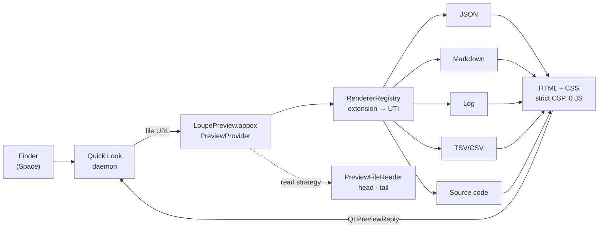

<div align="center">

# 🔍 Loupe

**Native Quick Look previews for developer files — JSON, Markdown, logs, source code and scripts.**<br>
Press <kbd>Space</kbd> in Finder. Get a readable, theme-aware preview. Zero JavaScript, zero telemetry, fully offline.

<a href="README.md"></a>
&nbsp;
<a href="README.de.md"></a>

<br>

<!-- Project status -->
[](https://github.com/pepperonas/loupe/releases/latest)
[](https://github.com/pepperonas/loupe/actions/workflows/ci.yml)
[](https://github.com/pepperonas/loupe/actions/workflows/release.yml)
[](#-testing)
[](Sources/)
[](LICENSE)
[](https://github.com/pepperonas/loupe/commits/main)
[](https://github.com/pepperonas/loupe/graphs/commit-activity)

<!-- Platform & technology -->
[](#-installation)
[](#-installation)
[](https://swift.org)
[](Package.swift)
[](Package.swift)
[](Sources/LoupePreview/PreviewProvider.swift)
[](Sources/Loupe/)
[-informational)](Package.swift)

<!-- Formats -->
[](#-json)
[](#-markdown)
[](#-log-files)
[](#-source-code)
[](#-powershell--batch)
[](#-powershell--batch)
[](#-xml)
[](#-tsv--csv)

<!-- Privacy, security, accessibility -->
[](Sources/LoupePreview/Resources/LoupePreview.entitlements)
[](#-security--privacy)
[](#-security--privacy)
[](#-security--privacy)
[](#-security--privacy)
[](#-security--privacy)
[](#-accessibility--theming)
[](#-accessibility--theming)

<!-- Community -->
[](https://github.com/pepperonas/loupe/stargazers)
[](https://github.com/pepperonas/loupe/network/members)
[](https://github.com/pepperonas/loupe/watchers)
[](https://github.com/pepperonas/loupe/issues)
[](https://github.com/pepperonas/loupe/pulls)
[](https://github.com/pepperonas/loupe/releases)
[](https://github.com/pepperonas/loupe)
[](https://github.com/pepperonas/loupe)
[](https://semver.org)
[](CHANGELOG.md)
[](#-contributing)

<br>

<picture>
  <source media="(prefers-color-scheme: dark)" srcset="docs/screenshots/hero-dark.png">
  
</picture>

<sub>Every preview on this page is Loupe's real HTML output, rendered by its actual renderers — only the window frame is drawn around it (<a href="#-screenshots--mockups">how</a>). Images follow your GitHub light/dark theme.</sub>

<br><br>

<a href="https://www.paypal.com/donate/?business=martin.pfeffer%40celox.io&item_name=Loupe&currency_code=EUR">
  
</a>

</div>

---

## 📑 Contents

- [Why Loupe?](#-why-loupe)
- [Gallery](#-gallery) — [JSON](#-json) · [Markdown](#-markdown) · [Log files](#-log-files) · [Source code](#-source-code) · [XML](#-xml) · [PowerShell & Batch](#-powershell--batch) · [TSV & CSV](#-tsv--csv)
- [Supported file types](#-supported-file-types)
- [Installation](#-installation)
- [Settings](#%EF%B8%8F-settings)
- [Performance](#-performance)
- [Security & privacy](#-security--privacy)
- [Accessibility & theming](#-accessibility--theming)
- [How it works](#%EF%B8%8F-how-it-works)
- [Testing](#-testing)
- [Troubleshooting](#-troubleshooting)
- [Contributing](#-contributing)
- [License](#-license)

---

## ✨ Why Loupe?

macOS shows most developer files in Quick Look as a grey wall of monospace text — or not at all. Loupe replaces that with previews that are built for reading:

| | |
| :--- | :--- |
| 🌳 **JSON as a tree** — collapsible, in source order, with counts and type colors. Broken files still show everything up to the error, plus a caret pointing at it. | 🪵 **Logs you can scan** — time, level, source and message in columns, errors tinted, stack traces kept together. Seven log formats recognized. |
| 📝 **Markdown, rendered** — CommonMark + GFM: tables, task lists, highlighted code, local images. | 🌈 **23 languages highlighted** — including PowerShell and Batch, which macOS doesn't even know as file types. |
| ⚡ **Fast** — a 5 MB JSON file renders in 162 ms, a 4 MB log in 338 ms. | 🔒 **Safe by design** — sandboxed, read-only, strict CSP, not a single byte of JavaScript, no network. |

---

## 🖼 Gallery

### 🌳 JSON

<picture>
  <source media="(prefers-color-scheme: dark)" srcset="docs/screenshots/json-dark.png">
  
</picture>

- **Order-preserving parser** — keys stay in file order, duplicate keys are kept, numbers keep their spelling (`1.000` stays `1.000`, not `1`).
- **Smart expansion** — nodes open breadth-first within a budget of 300 visible rows: a `package.json` opens completely, a 50,000-element array stays folded.
- **Collapsed summaries** — every object and array shows its size and a peek at its first keys.
- **Pure HTML** — folding uses `<details>`/`<summary>`, no script involved.

#### When the JSON is broken

<picture>
  <source media="(prefers-color-scheme: dark)" srcset="docs/screenshots/json-error-dark.png">
  
</picture>

A syntax error doesn't produce a blank page: Loupe shows **line, column and a source excerpt with a caret**, and below it the tree **up to the point of failure**. The caret stays aligned with tabs, umlauts and emoji. A file that was merely *cut off* by Loupe's size limit is reported as a notice, never as an error.

<details>
<summary><b>All JSON capabilities</b></summary>

| Feature | Detail |
| :--- | :--- |
| Objects & arrays | Member/item count badges and a peek of the collapsed content |
| Source key order | Preserved exactly, no alphabetical re-sorting |
| Duplicate keys | Both occurrences are shown |
| Numbers | Kept as written — no float rounding, `1e400` doesn't become `inf` |
| Strings & escapes | `\uXXXX`, surrogate pairs (😀), control characters |
| Partial tree on error | Everything parsed before the error stays visible |
| Error excerpt | Line, column, context lines, caret — aligned for tabs and multi-byte characters |
| JSON Lines hint | Content after the first value is recognized as JSON Lines and explained |
| Limits | Depth 64 · 20,000 nodes · 1,000 children per container · 4 KB per string · 20 MB per file |

</details>

### 📝 Markdown

<picture>
  <source media="(prefers-color-scheme: dark)" srcset="docs/screenshots/markdown-dark.png">
  
</picture>

CommonMark and GitHub Flavored Markdown via Apple's [`swift-markdown`](https://github.com/apple/swift-markdown): headings with anchors, emphasis, ~~strikethrough~~, blockquotes, nested and numbered lists, **task lists**, **tables with alignment**, fenced code blocks with syntax highlighting and a language badge, links, and **local images** (embedded as data URIs, confined to the document's folder). Raw HTML is sanitized, remote images are blocked unless you allow them.

<details>
<summary><b>All Markdown capabilities</b></summary>

| Feature | Syntax | Detail |
| :--- | :--- | :--- |
| Headings | `#` … `######` | Auto-generated anchor slugs |
| Emphasis | `**bold**`, `*italic*`, `~~strike~~` | SF Pro typography |
| Code | `` `inline` ``, fenced ```` ```lang ```` | Highlighted, with language badge |
| Blockquotes | `> note` | Callout style with accent border |
| Lists | `-`, `1.`, `3.` | Nested lists, custom start numbers |
| Task lists | `- [x]`, `- [ ]` | Native-looking checkboxes |
| Tables | `\| a \| b \|` | Column alignment, zebra rows |
| Links | `[t](https://…)` | Dangerous schemes (`javascript:`, `vbscript:`, `data:text/html`) are neutralized |
| Images | `` | Local files only, path traversal blocked, remote images off by default |
| Raw HTML | `<div>…</div>` | `<script>`, `<iframe>`, `<form>`, event handlers etc. are stripped |

</details>

### 🪵 Log files

<picture>
  <source media="(prefers-color-scheme: dark)" srcset="docs/screenshots/log-dark.png">
  
</picture>

Every line is split into **time · level · source · message** — whatever format it's in, even when formats are mixed in one file. The level is normalized (`WARN`, `warning`, `W` and pino's `40` all become **WARN**), the toolbar counts FATAL/ERROR/WARN, and error rows are tinted together with their stack trace. URLs, IPs, numbers with units, UUIDs, paths and `key=value` pairs are highlighted inside messages.

| Format | Example | Extracted |
| :--- | :--- | :--- |
| **Generic application log** | `2026-09-24 17:01:02.123 INFO [main] Started` | Time, level, `[source]`, message — also `[time]`, time-only, `[LEVEL]`, `level=…`, `channel.LEVEL:` (Laravel/Monolog), `LEVEL:logger:msg` (Python) |
| **nginx / Apache access log** | `203.0.113.7 - - [24/Sep/2026:…] "GET / HTTP/1.1" 503 0 …` | Client, method, path, protocol, status colored by class, size, referer, user agent · 4xx → WARN, 5xx → ERROR |
| **JSON Lines** | `{"time":…,"level":"error","msg":"boom"}` | `time`/`ts`/`@timestamp`, `level`/`severity` (incl. pino numbers), `msg`/`message`, `logger`; everything else as `key=value`. Unix times become readable UTC |
| **logfmt** | `time=… level=warning msg="disk low"` | Same fields as JSON Lines |
| **syslog / journalctl** | `Sep 24 17:01:02 host sshd[1234]: …` | Time, host + process[pid], message — also ISO time (`journalctl -o short-iso`, macOS `install.log`) |
| **macOS unified log** | output of `log show` | Time, process[pid], type → level (Default → NOTICE, Error → ERROR, Fault → FATAL) |
| **Android logcat** | `09-24 17:01:02.123 1234 5678 E Tag: …` | Time, level letter, tag, message (threadtime and brief) |

- **Levels come from the head of a line only** — a message that merely mentions "error" is not an error. Without a timestamp, a bare level word must be UPPERCASE or followed by `:` (`Info about the job` stays prose).
- **Big logs are read from the end.** Logs grow at the bottom, so Loupe reads the last 4 MB and shows the newest 5,000 lines — with **absolute line numbers** (the skipped part is counted, up to 512 MB). A banner says exactly what was skipped.
- Try it: [`Tests/Fixtures/logs/`](Tests/Fixtures/logs/) has one sample per format plus edge cases; `python3 Scripts/generate_large_log.py` creates a 12 MB log for the tail path.

### 🌈 Source code

<picture>
  <source media="(prefers-color-scheme: dark)" srcset="docs/screenshots/code-dark.png">
  
</picture>

An in-process tokenizer written in Swift highlights **23 languages**: Swift, Rust, Python, JavaScript, TypeScript, Go, Java, Kotlin, C, C++, PHP, Ruby, SQL, Shell/Bash/Zsh, **PowerShell**, **Batch**, JSON, YAML, TOML/INI, XML/HTML, CSS, Dockerfile — with line numbers, a language badge and file statistics. Tokens become `<span>`s on the host side; nothing executes in the preview.

### 🧩 XML

<picture>
  <source media="(prefers-color-scheme: dark)" srcset="docs/screenshots/xml-dark.png">
  
</picture>

A dedicated, quote-aware XML tokenizer: element names, attributes, values and brackets each get their own color, as do the `<?xml … ?>` declaration, `<!DOCTYPE …>` (including an internal DTD subset), comments, **CDATA sections** (shown as text, not markup) and entities like `&amp;` or `&#x1F600;`. A `>` inside an attribute value, comment, CDATA block or DOCTYPE never ends a tag. The same tokenizer powers HTML code blocks in Markdown, where `<script>`/`<style>` content is treated as raw text.

Besides `.xml`, Loupe declares a type for **13 XML dialects** macOS doesn't know — `.xsd`, `.xsl`, `.xslt`, `.xaml`, `.csproj`, `.vbproj`, `.fsproj`, `.vcxproj`, `.props`, `.targets`, `.resx`, `.wsdl`, `.nuspec` — so Quick Look hands them to Loupe too. `.svg`, `.rss` and `.plist` stay with macOS (an SVG keeps showing as an image), and `.storyboard`/`.xib`/`.entitlements` are left to Xcode.

### 🪟 PowerShell & Batch

<table>
<tr>
<td width="50%">
<picture>
  <source media="(prefers-color-scheme: dark)" srcset="docs/screenshots/powershell-dark.png">
  
</picture>
</td>
<td width="50%">
<picture>
  <source media="(prefers-color-scheme: dark)" srcset="docs/screenshots/batch-dark.png">
  
</picture>
</td>
</tr>
</table>

macOS assigns `.ps1`, `.bat` and `.cmd` only a *dynamic* type, so no Quick Look extension is ever asked to preview them. Loupe declares proper types (`com.microsoft.powershell-script`, `com.microsoft.batch-file`) and brings dedicated tokenizers:

- **PowerShell** — `<# help #>` blocks and `#` comments, variables incl. scopes (`$env:PATH`, `$script:x`, `${any name}`), cmdlets (`Get-ChildItem`), parameters (`-Path`), word operators (`-eq`, `-notin`, `-match`), type literals (`[string]`, `[System.IO.File]`), strings with **interpolation** of `$var` and `$(…)`, here-strings `@" … "@`, size literals (`10MB`), case-insensitive keywords.
- **Batch** — `REM` and `::` comments, labels and `goto :eof`, every variable form (`%PATH%`, `%~dp0`, `%1`, `%%i`, `%%~nxf`, `!delayed!`, `%DATE:~0,4%`), switches (`/b`, `/a`), case-insensitive keywords (`IF NOT EXIST`, `EQU`, `ERRORLEVEL`).

### 📊 TSV & CSV

<picture>
  <source media="(prefers-color-scheme: dark)" srcset="docs/screenshots/tsv-dark.png">
  
</picture>

Tab-separated and other delimited files become a proper table: **sticky header**, **sticky row numbers**, numbers right-aligned with tabular digits, delimiter auto-detection (`,` `;` `\t`), RFC 4180 quoting incl. multi-line cells, and a summary bar. Limits: 2,000 rows × 200 columns.

> [!IMPORTANT]
> **Comma-separated `.csv` files are not previewed by Loupe — and no Quick Look extension can change that.** macOS routes `public.comma-separated-values-text` to its built-in `/System/Library/QuickLook/Office.qlgenerator`, which takes precedence over every third-party extension and ignores Dark Mode. Loupe registers the type, yet Quick Look never calls it for `.csv` (verified in the unified log; a `.tsv` in the same session reaches Loupe). Declaring an own type for `.csv` doesn't help either — Launch Services keeps Apple's. The generator lives on the SIP-protected system volume. The same wall has been hit by CSV plugins since macOS 10.15 ([p2/quicklook-csv#26](https://github.com/p2/quicklook-csv/issues/26)). **Workaround:** save tabular data as `.tsv`.

---

## 📂 Supported file types

What matters is not what Loupe *can* render, but what **Quick Look actually hands to Loupe**. This table is checked against the extension's registration by a unit test (`DocsSyncTests`).

<!-- filetypes:start -->
| Format | Extensions | Type (UTI) | Finder preview |
| :--- | :--- | :--- | :---: |
| JSON | `.json` | `public.json` | ✅ |
| Markdown | `.md` `.markdown` | `net.daringfireball.markdown` | ✅ |
| Log | `.log` | `com.apple.log` → `public.log` | ✅ |
| Tab-separated | `.tsv` | `public.tab-separated-values-text` | ✅ |
| Comma-separated | `.csv` | `public.comma-separated-values-text` | ❌ reserved by macOS, [see above](#-tsv--csv) |
| PowerShell | `.ps1` `.psm1` `.psd1` | `com.microsoft.powershell-script` *(declared by Loupe)* | ✅ |
| Batch | `.bat` `.cmd` | `com.microsoft.batch-file` *(declared by Loupe)* | ✅ |
| Swift · Rust · Go | `.swift` `.rs` `.go` | `public.swift-source` · `org.rust-lang.rust-script` · `org.golang.go-script` | ✅ |
| Python · Ruby · PHP | `.py` `.rb` `.php` | `public.python-script` · `public.ruby-script` · `public.php-script` | ✅ |
| JavaScript | `.js` `.mjs` | `com.netscape.javascript-source` | ✅ |
| Java · Kotlin | `.java` `.kt` `.kts` | `com.sun.java-source` · `org.kotlinlang.source` | ✅ |
| C · C++ | `.c` `.h` `.cpp` `.cc` `.cxx` `.hpp` `.hxx` `.h++` | `public.c-source` · `public.c-plus-plus-source` · headers | ✅ |
| Shell | `.sh` `.bash` `.zsh` | `public.shell-script` and variants | ✅ |
| SQL | `.sql` | `org.iso.sql` | ✅ |
| YAML · TOML · INI | `.yaml` `.yml` `.toml` `.ini` | `public.yaml` · `public.toml` · `com.microsoft.ini` | ✅ |
| XML | `.xml` | `public.xml` | ✅ |
| XML dialects | `.xsd` `.xsl` `.xslt` `.xaml` `.csproj` `.vbproj` `.fsproj` `.vcxproj` `.props` `.targets` `.resx` `.wsdl` `.nuspec` | `io.celox.loupe.xml-document` *(declared by Loupe)* | ✅ |
| CSS | `.css` | `public.css` | ✅ |
<!-- filetypes:end -->

**Highlighted, but not reachable from Finder** — macOS gives these either a *dynamic* type or one that belongs to something else, so Quick Look never asks Loupe:

<!-- unreachable:start -->
- `.ts` — macOS types it as an **MPEG-2 transport stream** (video). Claiming it would turn real video files into text.
- `.tsx` `.jsx` `.cjs` `.pyw` `.scss` `.sass` `.less` `.dockerfile` — dynamic types only.
<!-- unreachable:end -->

The same is true for `.out`, `.err` and rotated logs like `app.log.1`: dynamic types — and claiming `.out` would additionally turn binaries like `a.out` into text.

---

## 📦 Installation

### Download (recommended)

1. Download `Loupe-vX.Y.Z-macOS.zip` from the [latest release](https://github.com/pepperonas/loupe/releases/latest) — builds are **Apple Silicon (arm64)**. Each release ships a `SHA256SUMS.txt`.
2. Unzip and move `Loupe.app` to `/Applications`.
3. The app is **ad-hoc signed**, not notarized. On first launch macOS will refuse to open it — either right-click → **Open**, use **System Settings → Privacy & Security → Open Anyway**, or run:
   ```bash
   xattr -dr com.apple.quarantine /Applications/Loupe.app
   ```
4. Launch Loupe once. The window shows whether the Quick Look extension is registered.

### Build from source

Requires Xcode 16 / Swift 6 command line tools. No Xcode project needed.

```bash
git clone https://github.com/pepperonas/loupe.git
cd loupe
./Scripts/install_app.sh      # build (release), sign ad-hoc, install to /Applications, register, reset Quick Look
```

`Scripts/build_app.sh [debug|release]` only builds the bundle into `build/Loupe.app`; `Scripts/package_release.sh vX.Y.Z` creates the release zip plus checksums.

### Enable the extension

Third-party Quick Look extensions need a one-time approval:

- **macOS 15 and later:** System Settings → **General → Login Items & Extensions** → *Quick Look* → enable **Loupe**.
- **macOS 14:** System Settings → **Privacy & Security → Extensions → Quick Look** → enable **Loupe**.
- Or from the terminal: `pluginkit -e use -i io.celox.loupe.preview`

Then select a file in Finder and press <kbd>Space</kbd>.

---

## ⚙️ Settings

The companion app (`Loupe.app`) shows the live registration status of the extension, setup hints, and three settings shared with the extension through an App Group:

| Setting | Options | Applies to |
| :--- | :--- | :--- |
| **Appearance** (Erscheinungsbild) | System · Light · Dark | All previews |
| **Text size** (Textgröße) | Small · Standard · Large | All previews |
| **Markdown width** (Markdown-Breite) | Compact 680 px · Standard 840 px · Wide 1040 px · Full width | Markdown |

> [!NOTE]
> The user interface of the app and the preview chrome (e.g. "12 Schlüssel", "25 Zeilen") is currently **German**. File contents are of course shown as they are.

---

## ⚡ Performance

Measured by the test suite (release build, Apple M1 Pro, macOS 27). The suite enforces hard upper bounds for the large cases — 1 s in release builds, 2.5 s in debug builds on shared CI runners — so a performance regression fails the build.

| Input | Renderer | Time |
| :--- | :--- | ---: |
| Small JSON document | JSON tree | **8 ms** |
| 5 MB JSON | JSON tree (node limit applies) | **162 ms** |
| 4 MB log (≈ 40,000 lines → newest 5,000) | Log table | **338 ms** |

Large files are never read completely: JSON and code are capped at 20 MB from the start, logs are read from the end (4 MB).

---

## 🔒 Security & privacy

Developer files often come from untrusted sources (`git clone`, downloads, build artifacts). Loupe treats every file as hostile input:

- **Sandboxed & read-only** — the extension runs in the App Sandbox with `com.apple.security.files.user-selected.read-only`, nothing else.
- **No JavaScript, anywhere** — previews are static HTML + CSS. Collapsing uses `<details>`.
- **Strict Content Security Policy** — `default-src 'none'; style-src 'unsafe-inline'; img-src 'none'` (Markdown: `img-src data: cid:`). No policy allows `script-src`.
- **Everything is escaped** — every value, key, log field, file name and code token goes through HTML escaping; tests feed `<script>` and `onerror=` through every renderer.
- **Markdown sanitizing** — dangerous elements and event handlers are stripped, `javascript:`/`vbscript:`/`data:text/html` links neutralized.
- **Path traversal guard** — local images are resolved with symlinks canonicalized and must stay inside the document's folder.
- **No network** — remote images are blocked by default (no tracking pixels), there is no telemetry and no update check.
- **Hard limits against hostile files** — JSON depth 64 (stack-overflow guard), 20,000 nodes, 1,000 children per container, 4 KB per displayed string, 20 MB per file; logs 4 MB / 5,000 lines; tables 2,000 rows × 200 columns.

---

## 🎨 Accessibility & theming

Light and dark themes follow the system (or your choice in the app) and use SF Pro / SF Mono. Every color role meets **WCAG AA (≥ 4.5 : 1)**:

- **JSON, Markdown and code colors** were measured on a canvas, composited over their real backgrounds (`Scripts/measure_contrast.html`) — ratios from **6.4 : 1** to **16.8 : 1**.
- **Log colors** (all levels, HTTP status classes, timestamps, sources) are checked by a **unit test** in both themes — including on the tinted background of error rows.

<details>
<summary><b>Measured JSON/Markdown color roles</b></summary>

| Role | Light (`#ffffff`) | Dark (`#1e1e1e`) |
| :--- | :--- | :--- |
| Text | `#1d1d1f` · 16.83 : 1 | `#f5f5f7` · 15.31 : 1 |
| Dimmed text | `#5b5e69` · 6.46 : 1 | `#a1a1a6` · 6.48 : 1 |
| Object key | `#0b5fb0` · 6.41 : 1 | `#7ab8ff` · 8.04 : 1 |
| String | `#b3261e` · 6.54 : 1 | `#ff8170` · 6.85 : 1 |
| Number | `#1c00cf` · 10.77 : 1 | `#dabaff` · 9.88 : 1 |
| Boolean | `#7a3ea3` · 6.90 : 1 | `#d8a0ff` · 8.25 : 1 |
| Keyword | `#af00db` · 6.42 : 1 | `#ff7ab2` · 8.12 : 1 |
| Link | `#0066cc` · 6.82 : 1 | `#2997ff` · 7.84 : 1 |
| Error banner | `#a5251c` · 6.72 : 1 | `#ff8a80` · 6.64 : 1 |

Negative control: `#cccccc` on `#ffffff` measures 1.61 : 1, proving the harness catches failures.

</details>

---

## 🏗️ How it works



1. **Finder** asks Quick Look for a preview; Quick Look hands the file URL to the **extension** because its type is listed in `QLSupportedContentTypes`.
2. The **`RendererRegistry`** picks a renderer by file extension first, then by type (UTI).
3. The renderer declares **how to read** the file: from the start (documents, code) or from the **end** (logs); `PreviewFileReader` reads only that part.
4. The renderer returns a **self-contained HTML page** (styles inline, strict CSP); Quick Look displays it in WebKit.

<details>
<summary><b>Project layout</b></summary>

```text
Loupe.app                         Companion app (AppKit): status, settings
└── Contents/PlugIns/LoupePreview.appex   Quick Look extension (QLPreviewProvider)

Sources/
├── Loupe/                        Companion app
├── LoupePreview/                 Extension entry point + Info.plist (QLSupportedContentTypes)
└── LoupeCore/                    Everything testable
    ├── JSON/                     Lexer, order-preserving parser with recovery, source excerpts
    ├── Markdown/                 swift-markdown visitor, sanitizer, safe image resolver
    ├── CSV/                      RFC 4180 parser with delimiter detection, table renderer
    ├── Log/                      Log model, format detection, message highlighter
    ├── Highlighting/             Tokenizers for 23 languages (incl. PowerShell & Batch)
    ├── Preview/                  Renderer protocol, registry, file reader, one renderer per format
    ├── Render/                   JSON tree, expansion planner, HTML escaping
    ├── Theme/                    CSS generator (light/dark, WCAG AA)
    ├── Configuration/            Settings shared via App Group
    └── Utilities/                Extension status checker (pluginkit)

Tests/LoupeTests/                 Test suite (swift run LoupeTests)
Tests/Fixtures/                   Sample files: JSON, Markdown, logs/, scripts/
Tools/ScreenshotGenerator/        Generates the mockups on this page
Scripts/                          Build, install, package, badges, large-log generator
```

</details>

---

## 🧪 Testing

```bash
swift run LoupeTests              # debug
swift run -c release LoupeTests   # release (as in the release workflow)
```

**306 tests** in a dependency-free harness, run by CI on every push:

| Area | Tests | Highlights |
| :--- | ---: | :--- |
| JSON | 70 | Order, duplicates, number spelling, recovery, limits incl. depth bomb, caret alignment |
| Log files | 64 | All seven formats, level normalization, stack traces, CRLF, tail reading, absolute line numbers, WCAG contrast |
| Highlighting | 63 | 23 languages, quote-aware XML/HTML, PowerShell & Batch, no phantom last line, **every printable character in every language must terminate and round-trip** |
| Markdown & safety | 41 | GFM, sanitizer bypass attempts, path traversal, remote-image blocking |
| TSV / CSV | 22 | RFC 4180 quoting, delimiter detection, limits |
| Theming & settings | 19 | Light/dark CSS, settings migration |
| Registry & app | 18 | Type routing, CSP, invalid UTF-8, empty files, pluginkit parsing |
| Docs sync | 6 | This README against the code: versions, test badge, image paths, EN/DE parity, Finder reachability |
| Performance | 3 | Hard time limits for large inputs |

How the tests are kept honest:

- **Mutation-checked.** New tests are verified by deliberately breaking the code they guard — a test that stays green against broken code is rewritten. This is how several initially blind tests were found and sharpened.
- **Documentation is tested.** `DocsSyncTests` fails when this README promises a file type Quick Look never delivers, when the test badge is stale, or when the English and German READMEs drift apart. `Scripts/update_readme_stats.sh` refreshes the badges.
- **Fixtures for manual testing** live in [`Tests/Fixtures/logs/`](Tests/Fixtures/logs/) and [`Tests/Fixtures/scripts/`](Tests/Fixtures/scripts/).

---

## 🛠️ Troubleshooting

| Symptom | Fix |
| :--- | :--- |
| Finder still shows plain text | Enable the extension ([see above](#enable-the-extension)), then `qlmanage -r && qlmanage -r cache && killall Finder` |
| Is the extension registered? | `pluginkit -m -v -i io.celox.loupe.preview` — a leading `+` means enabled |
| Old version keeps answering | List all copies: `pluginkit -m -A -v -p com.apple.quicklook.preview \| grep -i loupe`, remove stale ones, reinstall with `./Scripts/install_app.sh` |
| Which type does macOS assign a file? | `mdls -name kMDItemContentType <file>` — `dyn.…` means no extension will be asked |
| `.csv` is still white | Expected — macOS reserves CSV, [see above](#-tsv--csv). Use `.tsv`. |
| Watch the extension live | `log stream --predicate 'subsystem == "io.celox.loupe.preview"' --info` — logs the chosen renderer and output size for every preview |

---

## 🤝 Contributing

Issues and pull requests are welcome.

1. `swift run LoupeTests` must stay green — new behavior comes with tests (and ideally a failing test first).
2. User-visible changes go into [`CHANGELOG.md`](CHANGELOG.md) (Keep a Changelog, SemVer).
3. Changed rendering? Regenerate the mockups: `Tools/ScreenshotGenerator/generate.sh` (needs Google Chrome; `pngquant` optional).
4. Changed test count or code size? `Scripts/update_readme_stats.sh`.
5. Keep [`README.md`](README.md) and [`README.de.md`](README.de.md) in step — the docs-sync test checks it.

## 📸 Screenshots & mockups

The images on this page are generated by [`Tools/ScreenshotGenerator`](Tools/ScreenshotGenerator/): a small Swift tool renders the sample files through Loupe's **real `RendererRegistry` and renderers** (light and dark), a Python script places each result into a macOS-style Quick Look window, and headless Chrome captures it at 1.5× resolution. The window frame and background are drawn; the content is Loupe's unmodified output.

---

## 💖 Support

If Loupe saves you time, consider supporting its development:

<a href="https://www.paypal.com/donate/?business=martin.pfeffer%40celox.io&item_name=Loupe&currency_code=EUR"></a>

## 📄 License

MIT — see [LICENSE](LICENSE). Made with ❤️ by **Martin Pfeffer** · [celox.io](https://celox.io) · © 2026
